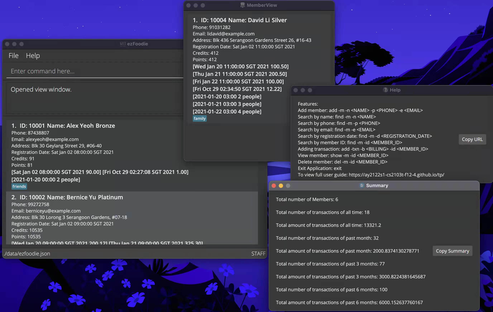

# ezFoodie :takeout_box:

* Have you faced some issues when managing the members in your restaurant? `ezFoodie` is here!

* `ezFoodie` is a desktop application that helps restaurants **keep track of their ever-growing list of members**. It is optimized for using via a **Command Line Interface (CLI)** while still having the benefits of a **Graphical User Interface (GUI)**. If you can type fast, ezFoodie can get your member management tasks done faster than traditional GUI applications.

* If you are interested in using `ezFoodie`, head over to the [_Quick Start_ section of the **User Guide**](https://ay2122s1-cs2103t-f12-4.github.io/tp/UserGuide.html#quick-start).

* If you are interested in developing `ezFoodie`, the [**Developer Guide**](https://ay2122s1-cs2103t-f12-4.github.io/tp/DeveloperGuide.html) is a good place to start.

## Acknowledgements

This project developed based on the **[Address Book Product Website](https://se-education.org/addressbook-level3)** project. Which is a part of the se-education.org initiative.

The icons of the project were obtained from [ezfoodie_icon](https://www.brandcrowd.com/), [member_icon](https://www.percici.com/), [summary_icon](https://www.pngwing.com/)

Libraries used:

* [JavaFX](https://openjfx.io/)
* [Jackson](https://github.com/FasterXML/jackson)
* [JUnit5](https://github.com/junit-team/junit5)
* [PlantUML](https://plantuml.com/)

If you would like to contribute code to this project, see [se-education.org](https://se-education.org#https://se-education.org/#contributing) for more information.
