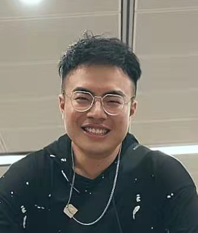
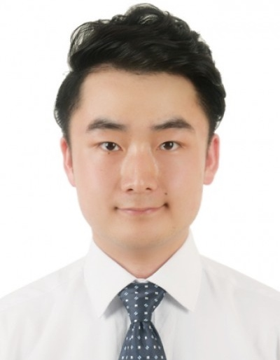

We are a team based in the [School of Computing, National University of Singapore](http://www.comp.nus.edu.sg).

You can reach us via email, as indicated below.

## Project team

---

### Hu Jiajun `e0556371@u.nus.edu`

[[github@holmesjj](http://github.com/holmesjj)]
[[portfolio@holmesjj](team/holmesjj.md)]

* Role: Tech lead, Git expert
* Responsibilities: Scheduling and tracking

---

### Raja Sudalaimuthu Mukund `mukundrs001@gmail.com`

[[github@mukundrs](https://github.com/mukundrs)]
[[portfolio@mukundrs](team/mukundrs.md)]

* Role: Developer
* Responsibilities: Documentation, deliverables and deadlines

---

### Zhang Zhiyao `e0449925@u.nus.edu`

[[github@zzybluebell](http://github.com/zzybluebell)]
[[portfolio@zzybluebell](team/zzybluebell.md)]

* Role: Developer
* Responsibilities: Integration, Testing and Documents

---

### Chen Shi Yao, Stephanie `stephaniechenshiyao@gmail.com`

[[github@stephanie-csy](http://github.com/stephanie-csy)]
[[portfolio@stephanie-csy](team/stephanie-csy.md)]

* Role: Developer
* Responsibilities: Code quality

---

### Yang Yuzhao `e0425130@u.nus.edu`

[[github@morrow1ndy](http://github.com/morrow1ndy)]
[[portfolio@morrow1ndy](team/morrow1ndy.md)]

* Role: Developer
* Responsibilities: Integration

---
