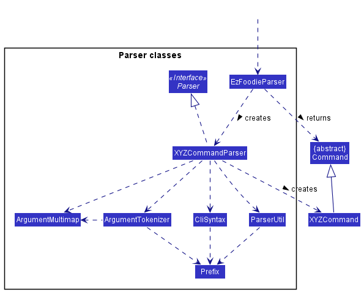

* Table of Contents
{:toc}

--------------------------------------------------------------------------------------------------------------------

## **Acknowledgements**

* {list here sources of all reused/adapted ideas, code, documentation, and third-party libraries -- include links to the original source as well}

--------------------------------------------------------------------------------------------------------------------

## **Setting up, getting started**

Refer to the guide [_Setting up and getting started_](SettingUp.md).

--------------------------------------------------------------------------------------------------------------------

## **Design**

:bulb: **Tip:** The `.puml` files used to create diagrams in this document can be found in the [diagrams](https://github.com/se-edu/addressbook-level3/tree/master/docs/diagrams/) folder. Refer to the [_PlantUML Tutorial_ at se-edu/guides](https://se-education.org/guides/tutorials/plantUml.html) to learn how to create and edit diagrams.

### Architecture

The ***Architecture Diagram*** given above explains the high-level design of the App.

Given below is a quick overview of main components and how they interact with each other.

**Main components of the architecture**

**`Main`** has two classes called [`Main`](https://github.com/se-edu/addressbook-level3/tree/master/src/main/java/seedu/address/Main.java) and [`MainApp`](https://github.com/se-edu/addressbook-level3/tree/master/src/main/java/seedu/address/MainApp.java). It is responsible for,
* At app launch: Initializes the components in the correct sequence, and connects them up with each other.
* At shut down: Shuts down the components and invokes cleanup methods where necessary.

[**`Commons`**](#common-classes) represents a collection of classes used by multiple other components.

The rest of the App consists of four components.

* [**`UI`**](#ui-component): The UI of the App.
* [**`Logic`**](#logic-component): The command executor.
* [**`Model`**](#model-component): Holds the data of the App in memory.
* [**`Storage`**](#storage-component): Reads data from, and writes data to, the hard disk.

**How the architecture components interact with each other**

The *Sequence Diagram* below shows how the components interact with each other for the scenario where the user issues the command `delete 1`.

Each of the four main components (also shown in the diagram above),

* defines its *API* in an `interface` with the same name as the Component.
* implements its functionality using a concrete `{Component Name}Manager` class (which follows the corresponding API `interface` mentioned in the previous point.

For example, the `Logic` component defines its API in the `Logic.java` interface and implements its functionality using the `LogicManager.java` class which follows the `Logic` interface. Other components interact with a given component through its interface rather than the concrete class (reason: to prevent outside component's being coupled to the implementation of a component), as illustrated in the (partial) class diagram below.

The sections below give more details of each component.

### UI component

The **API** of this component is specified in [`Ui.java`](https://github.com/se-edu/addressbook-level3/tree/master/src/main/java/seedu/address/ui/Ui.java)

The UI consists of a `MainWindow` that is made up of parts e.g.`CommandBox`, `ResultDisplay`, `PersonListPanel`, `StatusBarFooter` etc. All these, including the `MainWindow`, inherit from the abstract `UiPart` class which captures the commonalities between classes that represent parts of the visible GUI.

The `UI` component uses the JavaFx UI framework. The layout of these UI parts are defined in matching `.fxml` files that are in the `src/main/resources/view` folder. For example, the layout of the [`MainWindow`](https://github.com/se-edu/addressbook-level3/tree/master/src/main/java/seedu/address/ui/MainWindow.java) is specified in [`MainWindow.fxml`](https://github.com/se-edu/addressbook-level3/tree/master/src/main/resources/view/MainWindow.fxml)

The `UI` component,

* executes user commands using the `Logic` component.
* listens for changes to `Model` data so that the UI can be updated with the modified data.
* keeps a reference to the `Logic` component, because the `UI` relies on the `Logic` to execute commands.
* depends on some classes in the `Model` component, as it displays `Person` object residing in the `Model`.

### Logic component

**API** : [`Logic.java`](https://github.com/se-edu/addressbook-level3/tree/master/src/main/java/seedu/address/logic/Logic.java)

Here's a (partial) class diagram of the `Logic` component:

How the `Logic` component works:
1. When `Logic` is called upon to execute a command, it uses the `EzFoodieParser` class to parse the user command.
1. This results in a `Command` object (more precisely, an object of one of its subclasses e.g., `AddCommand`) which is executed by the `LogicManager`.
1. The command can communicate with the `Model` when it is executed (e.g. to add a person).
1. The result of the command execution is encapsulated as a `CommandResult` object which is returned back from `Logic`.

The Sequence Diagram below illustrates the interactions within the `Logic` component for the `execute("delete 1")` API call.

:information_source: **Note:** The lifeline for `DeleteCommandParser` should end at the destroy marker (X) but due to a limitation of PlantUML, the lifeline reaches the end of diagram.

Here are the other classes in `Logic` (omitted from the class diagram above) that are used for parsing a user command:

How the parsing works:
* When called upon to parse a user command, the `EzFoodieParser` class creates an `XYZCommandParser` (`XYZ` is a placeholder for the specific command name e.g., `AddCommandParser`) which uses the other classes shown above to parse the user command and create a `XYZCommand` object (e.g., `AddCommand`) which the `EzFoodieParser` returns back as a `Command` object.
* All `XYZCommandParser` classes (e.g., `AddCommandParser`, `DeleteCommandParser`, ...) inherit from the `Parser` interface so that they can be treated similarly where possible e.g, during testing.

### Model component
**API** : [`Model.java`](https://github.com/se-edu/addressbook-level3/tree/master/src/main/java/seedu/address/model/Model.java)

The `Model` component,

* stores the ezFoodie data i.e., all `Member` objects (which are contained in a `UniqueMemberList` object).
* stores the currently 'selected' `Member` objects (e.g., results of a search query) as a separate _filtered_ list which is exposed to outsiders as an unmodifiable `ObservableList<Member>` that can be 'observed' e.g. the UI can be bound to this list so that the UI automatically updates when the data in the list change.
* stores a `UserPref` object that represents the user’s preferences. This is exposed to the outside as a `ReadOnlyUserPref` objects.
* does not depend on any of the other three components (as the `Model` represents data entities of the domain, they should make sense on their own without depending on other components)

:information_source: **Note:** An alternative (arguably, a more OOP) model is given below. It has a `Tag` list in the `AddressBook`, which `Person` references. This allows `AddressBook` to only require one `Tag` object per unique tag, instead of each `Person` needing their own `Tag` objects. 

### Storage component

**API** : [`Storage.java`](https://github.com/se-edu/addressbook-level3/tree/master/src/main/java/seedu/address/storage/Storage.java)

The `Storage` component,
* can save both address book data and user preference data in json format, and read them back into corresponding objects.
* inherits from both `EzFoodieStorage` and `UserPrefStorage`, which means it can be treated as either one (if only the functionality of only one is needed).
* depends on some classes in the `Model` component (because the `Storage` component's job is to save/retrieve objects that belong to the `Model`)

### Common classes

Classes used by multiple components are in the `seedu.address.commons` package.

--------------------------------------------------------------------------------------------------------------------

## **Implementation**

This section describes some noteworthy details on how certain features are implemented.

### Find feature

`[written by: Hu Jiajun]`

#### Implementation

Given below is an example usage scenario and how the find mechanism behaves at each step.

1. The user executes `find -m -id 10001 10002` command to find the members with the member ids `10001` and `10002` in the application.

2. The command is handled by `LogicManager#execute(String)`, which then calls and passes this command to the `EzFoodieParser#parseCommand(String)` method.

3. The `EzFoodieParser` detects the command word `find` in the string and extracts the argument string `-m -id 10001 10002`.

4. The `EzFoodieParser` creates a new `FindCommandParser` instance to parse the argument string according to the format specified for `FindCommand`.

5. The argument string is parsed to the member ids array `[10001, 10002]` using the `FindCommandParser#parse(String)` method, which also performs validation.

6. The `FindCommandParser` creates a new `IdContainsKeywordsPredicate` instance with the member ids array `[10001, 10002]` to handle the filter.

7. The `FindCommandParser` creates a new `FindCommand` instance with the `IdContainsKeywordsPredicate` instance and returns it to `EzFoodieParser`, which in turn returns it to `LogicManager`.

8. The `LogicManager` calls the `FindCommand#execute(Model)` method.

9. The `FindCommand` calls the `Model#updateFilteredMemberList(IdContainsKeywordsPredicate)` method.

10. The `Model` calls the `FilteredList#setPredicate(IdContainsKeywordsPredicate)` to filter the members by the member ids `10001` and `10002`

11. The application lists the filtered members.

12. Lastly, the `FindCommand` creates a `CommandResult` with a `SuccessMessage` and returns it to `LogicManager`.

The above process is shown in the following sequence diagram:

**Sequence diagram showcasing the find command process**

:information_source: **Note:** The lifeline for `FindCommandParser`, `IdContainsKeywordsPredicate` and `FindCommand` should end at the destroy marker (X) but due to a limitation of PlantUML, the lifeline reaches the end of diagram.

The following activity diagram summarizes what happens when a user executes a new command to find the members by keywords:

**Activity diagram showcasing the find command execution flow**

#### Design consideration

**Aspect: How to execute different types of keywords with `FindCommand`**

* **Alternative 1 (current choice):** Add corresponding constructors for different types of keywords.
  * Pros: Easy to implement, only need to make a few changes to the source code.
  * Cons: Insufficient use of object-oriented features (inheritance and polymorphic).

* **Alternative 2:** Abstract `FindCommand`, create different classes according to different types of keywords to inherit `FindCommand`, such as `FindIdCommand`, `FindNameCommand`, `FindEmailCommand`, etc.
  * Pros: Sufficient use of object-oriented features (inheritance and polymorphic).
  * Cons: Have to make more changes to the source code, it may cause potential bugs.

### Sort feature

`[written by: Hu Jiajun]`

#### Implementation

Given below is an example usage scenario and how the sort mechanism behaves at each step.

1. The user executes `sort -m -c -a` command to sort the members by their credits in ascending order in the application.

2. The command is handled by `LogicManager#execute(String)`, which then calls and passes this command to the `EzFoodieParser#parseCommand(String)` method.

3. The `EzFoodieParser` detects the command word `sort` in the string and extracts the argument string `-m -c -a`.

4. The `EzFoodieParser` creates a new `SortCommandParser` instance to parse the argument string according to the format specified for `SortCommand`.

5. The argument string is parsed to `a` (ascending order) and converted to the enum tpye `SortStatus.ASC` using the `SortCommandParser#parse(String)` method, which also performs validation.

6. The `SortCommandParser` creates a new `CreditSortComparator` instance with the enum tpye `SortStatus.ASC` to handle the sort.

7. The `SortCommandParser` creates a new `SortCommand` instance with the `CreditSortComparator` instance and returns it to `EzFoodieParser`, which in turn returns it to `LogicManager`.

8. The `LogicManager` calls the `SortCommand#execute(Model)` method.

9. The `SortCommand` calls the `Model#updateSortedMemberList(CreditSortComparator)` method.

10. The `Model` calls the `SortedList#setComparator(CreditSortComparator)` method to sort the members by their credits in ascending order

11. The application lists the sorted members.

12. Lastly, the `SortCommand` creates a `CommandResult` with a `SuccessMessage` and returns it to `LogicManager`.

The above process is shown in the following sequence diagram:

**Sequence diagram showcasing the sort command process**

:information_source: **Note:** The lifeline for `SortCommandParser`, `CreditSortComparator` and `SortCommand` should end at the destroy marker (X) but due to a limitation of PlantUML, the lifeline reaches the end of diagram.

The following activity diagram summarizes what happens when a user executes a new command to sort the members by their credits:

**Activity diagram showcasing the sort command execution flow**

#### Design consideration

**Aspect: How to sort by different types of fields with `SortCommand`**

* **Alternative 1 (current choice):** Add corresponding constructors for different types of fields.
  * Pros: Easy to implement, only need to make a few changes to the source code.
  * Cons: Insufficient use of object-oriented features (inheritance and polymorphic).

* **Alternative 2:** Abstract `SortCommand`, create different classes according to different types of fields to inherit `SortCommand`, such as `SortPointCommand`, `SortCreditCommand`, etc.
  * Pros: Sufficient use of object-oriented features (inheritance and polymorphic).
  * Cons: Have to make more changes to the source code, it may cause potential bugs.

### Add member feature

`[written by: Zhang Zhiyao]`

#### Implementation

Given below is an example usage scenario and how the adding members behaves at each step.

1. The user executes `add -m -n -p -e -a` command to add a member in the Ezfoodie and its' storage

#### Design consideration

### Update Credit feature

`[written by: Zhang Zhiyao]`

#### Implementation

Given below is an example usage scenario and how the update credit feature behaves at each step.

1. when user add transaction , it will auto-trigger update new credit

#### Design consideration

### Update Point feature

`[written by: Zhang Zhiyao]`

#### Implementation

Given below is an example usage scenario and how the update point feature behaves at each step.

1. when user add transaction, it will auto update new point

2. The user executes `redeem -r -id` command to redeem point from exist credit by user id.

3. The user executes `redeem -r -index` command to redeem point from exist credit by user index listed in page.

#### Design consideration

### Add Reservation Feature

`[written by: Raja Sudalaimuthu Mukund]`

#### Implementation

Given below is an example usage scenario and how the add reservation mechanism behaves at each step.

1. The user executes `add -rs/ -dt/2021-01-01 00:00 -rm/2 people -id/10001` command to add a reservation for 2 people at
    2021-01-01 00:00 hrs to member id 10001's reservation list.

2. The command is handled by `LogicManager#execute(String)`, which then calls and passes this command to the 
    `EzFoodieParser#parseCommand(String)` method.

3. The EzFoodieParser detects the command word `add` in the string and extracts the argument string 
    `-rs/ -dt/2021-01-01 00:00 -rm/2 people -id/10001`.

4. The EzFoodieParser creates a new `AddCommandPrefixParser` instance to parse the argument string according to the 
    format specified for `AddCommand` and calls `AddCommandPrefixParser#parse(arguments)`.

5. `AddCommandPrefixParser#parse(arguments)` detects the prefix `-rs/` and creates a new instance of 
    `AddReservationCommandParser` and calls `AddReservationCommandParser#parse(arguments)`.

6. `AddReservationCommandParser#parse(arguments)` detects the prefixes `-dt/`, `-rm/` and `-id/` and parses them through 
    `ParseUtil` to obtain the `dateTime`, `remark` and the `memberID`.

7. Using the obtained `dateTime` and `remark`, a new instance of `Reservation` is created.

8. Using the new instance of `Reservation` and the obtained `memberID`, a new instance of `AddReservationCommand` is created and returned to 
    ezFoodieParser which in turn returns it to `LogicManager`.

9. `LogicManager` calls the `AddReservationCommand#execute(Model)` method.

10. The `AddReservationCommand` calls `Model#getUpdatedMemberList()` and searches the list to find the member with the respective
    `memberID` to obtain `memberToEdit`.

11. The `AddReservationCommand` calls `Model#createUpdatedReservations(memberToEdit, reservationToAdd)` to create a new 
    instance of the same member but with the new reservation added to the member's reservation list.

12. The `AddReservationCommand` calls `Model#setMember(memberToEdit, editedMember)` to replace the old instance of the member
    with its new instance.

13. The `AddReservationCommand` calls `Model#updateFilteredMemberList(PREDICATE_SHOW_ALL_MEMBERS)` to update the current
    member list with the updated member list.

14. The application lists the updated member list.

15. Lastly, `AddReservationCommand` creates a new instance of `CommandResult` with a success message, and returns it to Logic Manager.

#### Design consideration

### Delete Reservation Feature

`[written by: Chen Shi Yao, Stephanie]`

#### Implementation

Given below is an example usage scenario and how the delete reservation mechanism behaves at each step.

1. The user executes `del -rs/ -id/10001100001` command to delete the reservation with reservationId 100001 for the
    member with ID 10001.

2. The command is handled by `LogicManager#execute(String)`, which then calls and passes this command to the
   `EzFoodieParser#parseCommand(String)` method.

3. The EzFoodieParser detects the command word `del` in the string and extracts the argument string
   `-rs/ -id/10001100001`.

4. The EzFoodieParser creates a new `DeleteCommandPrefixParser` instance to parse the argument string according to the
   format specified for `DeleteCommand` and calls `DeleteCommandPrefixParser#parse(arguments)`.

5. `DeleteCommandPrefixParser#parse(arguments)` detects the prefix `-rs/` and creates a new instance of
   `DeleteReservationCommandParser` and calls `DeleteReservationCommandParser#parse(arguments)`.

6. `DeleteReservationCommandParser#parse(arguments)` detects the prefixes `-id/` and parses them through
   `ParseUtil` to obtain the `memberId` and `ReservationId`.

7. Using the obtained `memberID` and `ReservationId`, a new instance of `DeleteReservationCommand` is created and returned to
   ezFoodieParser which in turn returns it to `LogicManager`. 

8. `LogicManager` calls the `DeleteReservationCommand#execute(Model)` method.

9. The `DeleteReservationCommand` calls `Model#getUpdatedMemberList()` and searches the list to find the member with the respective
    `memberID` to obtain `memberToEdit`.
   
10. Using the `reservationId`, the `DeleteReservationCommand` then searches the list of `Reservations` associated with the 
    `memberToEdit` to find the `reservationToDelete`.

11. The `DeleteReservationCommand` calls `DeleteReservationCommand#createEditedMember(memberToEdit, reservationToDelete)` to create a new
    instance of the same member but with the reservation deleted from the member's reservation list.

12. The `DeleteReservationCommand` calls `Model#setMember(memberToEdit, editedMember)` to replace the old instance of the member
    with its new instance.

13. The `DeleteReservationCommand` calls `Model#updateFilteredMemberList(PREDICATE_SHOW_ALL_MEMBERS)` to update the current
    member list with the updated member list.

14. The application lists the updated member list.

15. Lastly, `DeleteReservationCommand` creates a new instance of `CommandResult` with a success message, and returns it to Logic Manager.

### \[Proposed\] Undo/redo feature

#### Proposed Implementation

The proposed undo/redo mechanism is facilitated by `VersionedAddressBook`. It extends `AddressBook` with an undo/redo history, stored internally as an `addressBookStateList` and `currentStatePointer`. Additionally, it implements the following operations:

* `VersionedAddressBook#commit()` — Saves the current address book state in its history.
* `VersionedAddressBook#undo()` — Restores the previous address book state from its history.
* `VersionedAddressBook#redo()` — Restores a previously undone address book state from its history.

These operations are exposed in the `Model` interface as `Model#commitAddressBook()`, `Model#undoAddressBook()` and `Model#redoAddressBook()` respectively.

Given below is an example usage scenario and how the undo/redo mechanism behaves at each step.

Step 1. The user launches the application for the first time. The `VersionedAddressBook` will be initialized with the initial address book state, and the `currentStatePointer` pointing to that single address book state.

Step 2. The user executes `delete 5` command to delete the 5th person in the address book. The `delete` command calls `Model#commitAddressBook()`, causing the modified state of the address book after the `delete 5` command executes to be saved in the `addressBookStateList`, and the `currentStatePointer` is shifted to the newly inserted address book state.

Step 3. The user executes `add n/David …​` to add a new person. The `add` command also calls `Model#commitAddressBook()`, causing another modified address book state to be saved into the `addressBookStateList`.

:information_source: **Note:** If a command fails its execution, it will not call `Model#commitAddressBook()`, so the address book state will not be saved into the `addressBookStateList`.

Step 4. The user now decides that adding the person was a mistake, and decides to undo that action by executing the `undo` command. The `undo` command will call `Model#undoAddressBook()`, which will shift the `currentStatePointer` once to the left, pointing it to the previous address book state, and restores the address book to that state.

:information_source: **Note:** If the `currentStatePointer` is at index 0, pointing to the initial AddressBook state, then there are no previous AddressBook states to restore. The `undo` command uses `Model#canUndoAddressBook()` to check if this is the case. If so, it will return an error to the user rather
than attempting to perform the undo.

The following sequence diagram shows how the undo operation works:

:information_source: **Note:** The lifeline for `UndoCommand` should end at the destroy marker (X) but due to a limitation of PlantUML, the lifeline reaches the end of diagram.

The `redo` command does the opposite — it calls `Model#redoAddressBook()`, which shifts the `currentStatePointer` once to the right, pointing to the previously undone state, and restores the address book to that state.

:information_source: **Note:** If the `currentStatePointer` is at index `addressBookStateList.size() - 1`, pointing to the latest address book state, then there are no undone AddressBook states to restore. The `redo` command uses `Model#canRedoAddressBook()` to check if this is the case. If so, it will return an error to the user rather than attempting to perform the redo.

Step 5. The user then decides to execute the command `list`. Commands that do not modify the address book, such as `list`, will usually not call `Model#commitAddressBook()`, `Model#undoAddressBook()` or `Model#redoAddressBook()`. Thus, the `addressBookStateList` remains unchanged.

Step 6. The user executes `clear`, which calls `Model#commitAddressBook()`. Since the `currentStatePointer` is not pointing at the end of the `addressBookStateList`, all address book states after the `currentStatePointer` will be purged. Reason: It no longer makes sense to redo the `add n/David …​` command. This is the behavior that most modern desktop applications follow.

The following activity diagram summarizes what happens when a user executes a new command:

#### Design considerations

**Aspect: How undo & redo executes:**

* **Alternative 1 (current choice):** Saves the entire address book.
  * Pros: Easy to implement.
  * Cons: May have performance issues in terms of memory usage.

* **Alternative 2:** Individual command knows how to undo/redo by itself.
  * Pros: Will use less memory (e.g. for `delete`, just save the person being deleted).
  * Cons: We must ensure that the implementation of each individual command are correct.

_{more aspects and alternatives to be added}_

### \[Proposed\] Data archiving

_{Explain here how the data archiving feature will be implemented}_

--------------------------------------------------------------------------------------------------------------------

## **Documentation, logging, testing, configuration, dev-ops**

* [Documentation guide](Documentation.md)
* [Testing guide](Testing.md)
* [Logging guide](Logging.md)
* [Configuration guide](Configuration.md)
* [DevOps guide](DevOps.md)

--------------------------------------------------------------------------------------------------------------------

## **Appendix: Requirements**

### Product scope

**Target user profile story**:

Ben is a restaurant manager. He found that restaurants are becoming more and more popular, the number of members is increasing, and there are a large number of reservations every day. Every day the front desk staffs spend a lot of time in excel or on paper to record new members, record reservations and transactions, and find reservations. With the need to handle multiple tasks at the same time, the staffs are also prone to make careless mistakes at work due to fatigue. 😞

More importantly, the member list is only stored in excel, it makes it difficult for Ben to manage and analyze members to formulate targeted promotional strategies, which will have bad impact on the profit expansion of the restaurant. 😞

As a manager who is proficient in technology and has commendable experience in Unix, Ben hopes to develop an easy-to-operate application to improve the work efficiency of himself and the staffs. 🤩

**Target user profile summary**:

Managers and staffs who

* work in highly popular restaurants whose number of members is increasing
* are responsible for managing a large number of member registrations, transactions and reservations daily
* are required to multi-task (manage member registrations and reservations)
* need to manage and analyze members to formulate promotional strategies
* are proficient in technology
* want to get things done quickly
* are tired of tracking member details from paper or excel
* prefer desktop apps over other types
* can type fast
* prefer typing to using mouse
* are reasonably comfortable using CLI apps

**Value proposition**: 

helps restaurants keep track of their ever-growing list of members. Restaurant managers and staffs can easily view and update member status (e.g. personal information, tier, reservation, transaction, etc.) to manage and analyze members based on various criteria faster than a typical mouse/GUI driven application.

### User stories

Priorities: High (must have) - `* * *`, Medium (nice to have) - `* *`, Low (unlikely to have) - `*`

| Priority | As a …​  | I want to …​                                               | So that I can …​                                                        |
| -------- | --------| --------------------------------------------------------- | ---------------------------------------------------------------------- |
| `* * *`  | staff   | view help                                                 | easily check how to use the commands and access the user guide         |
| `* * *`  | staff   | exit the program                                          |                                                                        |
| `* * *`  | staff   | list out a certain number of members                      | easily view and access the member basic information                    |
| `* * *`  | staff   | add new members                                           | easily the track member statuses                                       |
| `* * *`  | staff   | find members by name                                      | easily find the specific members to check their details                |
| `* * *`  | staff   | find member by phone                                      | easily find the specific member to check his/her details               |
| `* * *`  | staff   | find member by email                                      | easily find the specific member to check his/her details               |
| `* * *`  | staff   | find members by registration date                         | easily find a member to check their details                            |
| `* * *`  | staff   | find member by member ID                                  | easily find the specific member to check his/her details               |
| `* * *`  | staff   | view member profile                                       | easily check the specific member's details                             |
| `* * *`  | staff   | add transaction for members                               | easily track the transaction history of members                        |
| `* * *`  | staff   | redeem a member’s points                                  |                                                                        |
| `* * *`  | staff   | mark reservation for member                               |                                                                        |
| `* * *`  | manager | clear the program                                         | Initialize the entire program                                          |
| `* * *`  | manager | login as a manager                                        | access manager-only features, e.g. sort the members by their credits   |
| `* * *`  | manager | logout as a manager                                       | prevent staff from accessing manager-only features                     |
| `* * *`  | manager | sort members by tier                                      | easily analyze the members' consumption and distribution               |
| `* * *`  | manager | sort members by credit                                    | easily offer promotions to the members with the highest consumption    |
| `* * *`  | manager | edit member name                                          | update member information to latest                                    |
| `* * *`  | manager | edit member phone                                         | update member information to latest                                    |
| `* * *`  | manager | edit member email                                         | update member information to latest                                    |
| `* * *`  | manager | delete member by member ID                                | remove member that I no longer need                                    |
| `* *  `  | staff   | unmark reservation for member                             | remove reservation for member that I no longer need                    |
| `* *  `  | staff   | edit reservation for member                               | update reservation for member to latest                                |
| `* *  `  | staff   | find reservations by date                                 | easily find the coming reservations                                    |
| `* *  `  | staff   | be automatically reminded when a reservation is coming    | prepare for seats for the member in time                               |
| `*    `  | staff   | undo previous command                                     | easily cancel previous command with accidental mistakes                |
| `*    `  | staff   | redo previous command                                     | easily speed up the typing speed of command                            |
| `*    `  | staff   | retrieve previous command                                 | easily speed up the typing speed of command                            |
| `*    `  | manager | delete a transaction detail                               | correct any accidental mistakes                                        |
| `*    `  | manager | edit a transaction detail                                 | correct any accidental mistakes                                        |
| `*    `  | manager | view a visualisation of the summary in a certain period   | know the summary details in a certain period, e.g. total registrations |
| `*    `  | manager | edit the amount of credit needed for each membership tier | easily control the number of members for each tier                     |
| `*    `  | manager | list number of registrations in a certain month           | easily manage and analyze members                                      |
| `*    `  | manager | list number of registrations in a few past weeks          | easily manage and analyze members                                      |
| `*    `  | manager | list number of registrations in a certain period          | easily manage and analyze members                                      |
| `*    `  | Manager | add promo code for members                                | easily implement promotional strategies                                |

*{More to be added}*

### Use cases

(For all use cases below, the **System** is the `ezFoodie` and the **Actor** is the `Staff` or only the `Manager`, unless specified otherwise)

**Use case: UC01 - View help**

**Actors: Staff**

**MSS**

1.  Staff requests to view help.
2.  ezFoodie shows a dialog contains how to use the commands and access the user guide.

    Use case ends.

**Extensions**

* 1a. The given input is invalid.

    * 1a1. ezFoodie shows an error message.

      Use case ends.

**Use case: UC02 - Exit the program**

**Actors: Staff**

**MSS**

1.  Staff requests to exits the program.
2.  ezFoodie exits.

    Use case ends.

**Extensions**

* 1a. The given input is invalid.

    * 1a1. ezFoodie shows an error message.

      Use case ends.

<b>Use case: <label id="UC03">UC03</label> - List out a certain number of members</b>

**Actors: Staff**

**MSS**

1.  Staff requests to list out a certain number of members by page.
2.  ezFoodie shows a list of members by page.

    Use case ends.

**Extensions**

* 1a. The given input is invalid.

    * 1a1. ezFoodie shows an error message.

      Use case ends.

* 1b. The given page number exceeded the maximum number of pages.

    * 1b1. ezFoodie shows an error message.

      Use case ends.

* 2a. The list is empty.

  Use case ends.

**Use Case: UC04 - Add a member**

**Actors: Staff**

**MSS**

1.  Staff requests to add the information of a member to the list.
2.  The member is created in ezFoodie with the given information.

    Use case ends.

**Extensions**

* 1a. The given input is invalid.

    * 1a1. ezFoodie shows an error message.
      
      Use case ends.

* 1b. The member (phone or email) already exists in the list.

    * 1b1. ezFoodie shows an error message.

      Use case ends.

<b>Use case: <label id="UC05">UC05</label> - find a member by [field]</b>

**Actors: Staff**

**MSS**

1.  Staff requests to find a member by [field] with keywords, [field] can be member ID, name, phone, email or registration date.
2.  ezFoodie shows a list of members whose [field] matches the keywords.

    Use case ends.

**Extensions**

* 1a. The given input is invalid.

    * 1a1. ezFoodie shows an error message.

      Use case ends.

* 2a. The list is empty.

  Use case ends.

**Use case: UC06 - View member profile**

**Actors: Staff**

**MSS**

1.  Staff requests to <u>list a set of members (<a href="#UC03">UC03</a> or <a href="#UC05">UC05</a>)</u>.
2.  Staff requests to view a specific member in the list by member ID.
3.  ezFoodie shows the specific member's details.

    Use case ends.

**Extensions**

* 2a. The given input is invalid.

    * 2a1. ezFoodie shows an error message.

      Use case resumes at step 1.

* 2b. The given member ID does not exist in the list.

    * 2b1. ezFoodie shows an error message.

      Use case resumes at step 1.

**Use case: UC07 - Add a transaction for a member**

**Actors: Staff**

**MSS**

1.  Staff requests to <u>list a set of members (<a href="#UC03">UC03</a> or <a href="#UC05">UC05</a>)</u>.
2.  Staff requests to add transaction details for a member by member ID.
3.  The transaction of the member is created in ezFoodie.

    Use case ends.

**Extensions**

* 2a. The given input is invalid.

    * 2a1. ezFoodie shows an error message.

      Use case resumes at step 1.

* 2b. The given member ID does not exist in the list.

    * 2b1. ezFoodie shows an error message.

      Use case resumes at step 1.

**Use case: UC08 - Redeem a member’s points**

**Actors: Staff**

**MSS**

1.  Staff requests to <u>list a set of members (<a href="#UC03">UC03</a> or <a href="#UC05">UC05</a>)</u>.
2.  Staff requests to redeem one gift (e.g. 1 item = 100 points) for a member by member ID.
3.  The points of the member are deducted (e.g. -100 points) in ezFoodie.

**Extensions**

* 2a. The given input is invalid.

    * 2a1. ezFoodie shows an error message.

      Use case resumes at step 1.

* 2b. The given member ID does not exist in the list.

    * 2b1. ezFoodie shows an error message.

      Use case resumes at step 1.

* 2c. The member does not have enough points.

    * 2c1. ezFoodie shows an error message.

      Use case resumes at step 1.

**Use case: UC09 - Mark reservation for member**

**Actors: Staff**

**MSS**

1.  Staff requests to <u>list a set of members (<a href="#UC03">UC03</a> or <a href="#UC05">UC05</a>)</u>.
2.  Staff requests to mark reservation for the member by member ID.
3.  A reservation date time of the member is marked in ezFoodie.

**Extensions**

* 2a. The given input is invalid.

    * 2a1. ezFoodie shows an error message.

      Use case resumes at step 1.

* 2b. The given member ID does not exist in the list.

    * 2b1. ezFoodie shows an error message.

      Use case resumes at step 1.

* 2c. The reservation date time is not after the current date time.

    * 2c1. ezFoodie shows an error message.

      Use case resumes at step 1.

**Use case: UC10 - Clear the program**

**Actors: Manager**

**Preconditions**

Manager is logged in

**MSS**

1.  Manager requests to clear and initialize the entire program.
2.  All the data in ezFoodie is removed.

**Extensions**

* 1a. The given input is invalid.

    * 1a1. ezFoodie shows an error message.

      Use case ends.

**Use case: UC11 - Login as a manager**

**Actors: Manager**

**MSS**

1.  Manager requests to login as a manager.
2.  ezFoodie switch to Manager Mode.

**Extensions**

* 1a. The given input is invalid.

    * 1a1. ezFoodie shows an error message.

      Use case ends.

* 1b. The password is not correct.

    * 1b1. ezFoodie shows an error message.

      Use case ends.

**Use case: UC12 - Logout as a manager**

**Actors: Manager**

**Preconditions**

Manager is logged in

**MSS**

1.  Manager requests to logout as a manager.
2.  ezFoodie switch to Normal Mode.

**Extensions**

* 1a. The given input is invalid.

    * 1a1. ezFoodie shows an error message.

      Use case ends.

**Use case: UC13 - Sort members by [field]**

**Actors: Manager**

**Preconditions**

Manager is logged in

**MSS**

1.  Manager requests to sort members by [field], [field] can be name, phone or email.
2.  ezFoodie shows a list of members sorted by the [field].

    Use case ends.

**Extensions**

* 1a. The given input is invalid.

    * 1a1. ezFoodie shows an error message.

      Use case ends.

* 2a. The list is empty.

  Use case ends.

**Use case: UC14 - Edit member [field]**

**Actors: Manager**

**Preconditions**

Manager is logged in

**MSS**

1.  Manager requests to <u>list a set of members (<a href="#UC03">UC03</a> or <a href="#UC05">UC05</a>)</u>.
2.  Manager requests to edit member [field] by member ID, [field] can be name, phone or email.
3.  ezFoodie shows the updated information of the member.

    Use case ends.

**Extensions**

* 2a. The given input is invalid.

    * 2a1. ezFoodie shows an error message.

      Use case resumes at step 1.

* 2b. The given member ID does not exist in the list.

    * 2b1. ezFoodie shows an error message.

      Use case resumes at step 1.

* 2c. The new phone or email already exists in the list.

    * 2c1. ezFoodie shows an error message.

      Use case resumes at step 1.

**Use case: UC15 - Delete member by member ID**

**Actors: Manager**

**Preconditions**

Manager is logged in

**MSS**

1.  Manager requests to <u>list a set of members (<a href="#UC03">UC03</a> or <a href="#UC05">UC05</a>)</u>.
2.  Manager requests to delete the member by member ID.
3.  The member is deleted from ezFoodie.

    Use case ends.

**Extensions**

* 2a. The given input is invalid.

    * 2a1. ezFoodie shows an error message.

      Use case resumes at step 1.

* 2b. The given member ID does not exist in the list.

    * 2b1. ezFoodie shows an error message.

      Use case resumes at step 1.

**Use case: UC16 - Unmark reservation for member**

**Actors: Staff**

**MSS**

1.  Staff requests to <u>list a set of members (<a href="#UC03">UC03</a> or <a href="#UC05">UC05</a>)</u>.
2.  Staff requests to unmark reservation for the member by member ID.
3.  A reservation date time of the member is unmarked in ezFoodie.

**Extensions**

* 2a. The given input is invalid.

    * 2a1. ezFoodie shows an error message.

      Use case resumes at step 1.

* 2b. The given member ID does not exist in the list.

    * 2b1. ezFoodie shows an error message.

      Use case resumes at step 1.

**Use case: UC17 - Edit reservation for member**

**Actors: Staff**

**MSS**

1.  Staff requests to <u>list a set of members (<a href="#UC03">UC03</a> or <a href="#UC05">UC05</a>)</u>.
2.  Staff requests to edit reservation for the member by member ID.
3.  A reservation date time of the member is updated in ezFoodie.

**Extensions**

* 2a. The given input is invalid.

    * 2a1. ezFoodie shows an error message.

      Use case resumes at step 1.

* 2b. The given member ID does not exist in the list.

    * 2b1. ezFoodie shows an error message.

      Use case resumes at step 1.

* 2c. The reservation date time is not after the current date time.

    * 2c1. ezFoodie shows an error message.

      Use case resumes at step 1.

**Use case: UC18 - find reservations by date**

**Actors: Staff**

**MSS**

1.  Staff requests to find reservations by date.
2.  ezFoodie shows a list of reservations for the date.

    Use case ends.

**Extensions**

* 1a. The given input is invalid.

    * 1a1. ezFoodie shows an error message.

      Use case ends.

* 2a. The list is empty.

  Use case ends.

*{More to be added}*

### Non-Functional Requirements

1.  Should work on any _mainstream OS_ as long as it has Java `11` or above installed.
2.  Should be able to hold up to 1000 members without a noticeable sluggishness in performance for typical usage.
3.  Should be able to hold up to 5000 transactions without a noticeable sluggishness in performance for typical usage.
4.  A user with above average typing speed for regular English text (i.e. not code, not system admin commands) should be able to accomplish most of the tasks faster using commands than using the mouse.
5.  The application should not exceed 50mb in size.
6.  The documentation should be easy to understand.

*{More to be added}*

### Glossary

* **Mainstream OS**: Windows, Linux, Unix, OS-X
* **CSV File**: A comma-separated values file is a delimited text file that uses a comma to separate values. Each line of the file is a data record. Each record consists of one or more fields, separated by commas. And it can be opened using Microsoft Excel (Ref: https://en.wikipedia.org/wiki/Comma-separated_values)
* **JSON file**: A file that uses human-readable text to store and transmit data objects consisting of attribute–value pairs and arrays (or other serializable values) (Ref: https://en.wikipedia.org/wiki/JSON)
* **Staff**: All employees of the restaurant who will be using the product
* **Manager**: A special subset of staff with higher permission who can get special access to certain higher level features
* **Normal Mode**: The mode before the manager login, Normal Mode by default
* **Manager Mode**: The mode after the manager login
* **Membership Tiers**: Different membership tiers give members different benefits. Tiers include Silver, Gold, and Platinum
* **Member Details**: Member ID, Name, Phone, Membership Tiers, Registration Date, Email, Credits, Points, Transaction
* **Credits**: Represents total amount of money spent at the restaurant (S$1 = 1 credit), accumulated and cannot be decreased
* **Points**: Earned by 6 times of spending money, can be used to redeem gifts and will be spent
* **Transaction**: A payment made by a customer at the restaurant
* **Promo Code**: A string that when used by the customer, gives customer benefits such as discounts or free items
* **Redemption**: Points that a member has can be redeemed for free items, and the points will then be deducted from the member’s account
* **Reservation**: A tag contains specific date time represents when the member will come for a meal

--------------------------------------------------------------------------------------------------------------------

## **Appendix: Instructions for manual testing**

Given below are instructions to test the app manually.

:information_source: **Note:** These instructions only provide a starting point for testers to work on;
testers are expected to do more *exploratory* testing.

### Launch and shutdown

1. Initial launch

   1. Download the jar file and copy into an empty folder

   1. Double-click the jar file Expected: Shows the GUI with a set of sample contacts. The window size may not be optimum.

1. Saving window preferences

   1. Resize the window to an optimum size. Move the window to a different location. Close the window.

   1. Re-launch the app by double-clicking the jar file. 
       Expected: The most recent window size and location is retained.

1. _{ more test cases …​ }_

### Deleting a person

1. Deleting a person while all persons are being shown

   1. Prerequisites: List all persons using the `list` command. Multiple persons in the list.

   1. Test case: `delete 1` 
      Expected: First contact is deleted from the list. Details of the deleted contact shown in the status message. Timestamp in the status bar is updated.

   1. Test case: `delete 0` 
      Expected: No person is deleted. Error details shown in the status message. Status bar remains the same.

   1. Other incorrect delete commands to try: `delete`, `delete x`, `...` (where x is larger than the list size) 
      Expected: Similar to previous.

1. _{ more test cases …​ }_

### Saving data

1. Dealing with missing/corrupted data files

   1. _{explain how to simulate a missing/corrupted file, and the expected behavior}_

1. _{ more test cases …​ }_
