* Table of Contents
{:toc}

--------------------------------------------------------------------------------------------------------------------

## **Introduction**

This document is the developer guide for ezFoodie, an member manamgement application for restaurant managers and staffs.

This developer guide serves to provide developers with an understanding on how ezFoodie is designed and developed.

--------------------------------------------------------------------------------------------------------------------

## **Acknowledgements**

This project developed based on the **[Address Book Product Website](https://se-education.org/addressbook-level3)** project. Which is a part of the se-education.org initiative.

The icons of the project were obtained from [ezfoodie_icon](https://www.brandcrowd.com/), [member_icon](https://www.percici.com/), [summary_icon](https://www.pngwing.com/)

Libraries used:

* [JavaFX](https://openjfx.io/)
* [Jackson](https://github.com/FasterXML/jackson)
* [JUnit5](https://github.com/junit-team/junit5)
* [PlantUML](https://plantuml.com/)

If you would like to contribute code to this project, see [se-education.org](https://se-education.org#https://se-education.org/#contributing) for more information.

--------------------------------------------------------------------------------------------------------------------

## **Setting up, getting started**

Refer to the guide [_Setting up and getting started_](SettingUp.md).

--------------------------------------------------------------------------------------------------------------------

## **Design**

:bulb: **Tip:** The `.puml` files used to create diagrams in this document can be found in the [diagrams](https://github.com/AY2122S1-CS2103T-F12-4/tp/tree/master/docs/diagrams/) folder. Refer to the [_PlantUML Tutorial_ at se-edu/guides](https://se-education.org/guides/tutorials/plantUml.html) to learn how to create and edit diagrams.

### Architecture

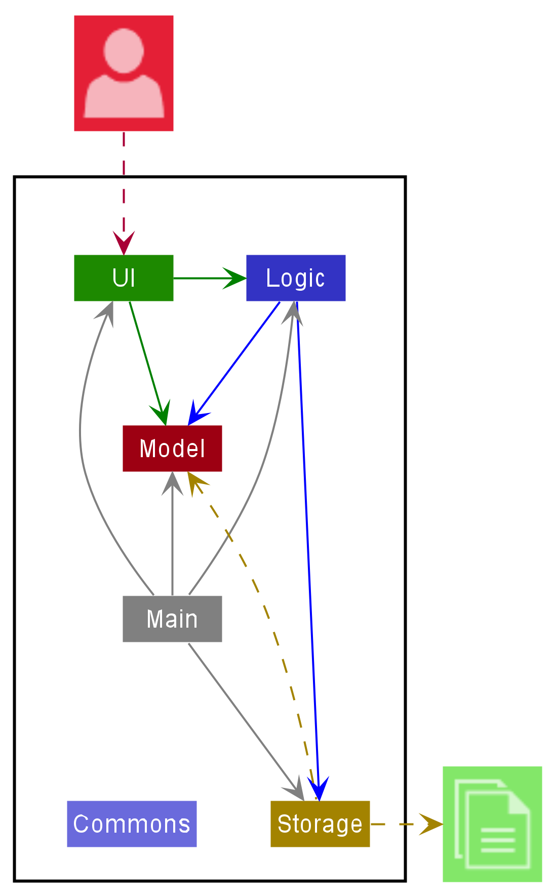

The ***Architecture Diagram*** given above explains the high-level design of the App.

Given below is a quick overview of main components and how they interact with each other.

**Main components of the architecture**

**`Main`** has two classes called [`Main`](https://github.com/AY2122S1-CS2103T-F12-4/tp/tree/master/src/main/java/seedu/address/Main.java) and [`MainApp`](https://github.com/AY2122S1-CS2103T-F12-4/tp/tree/master/src/main/java/seedu/address/MainApp.java). It is responsible for,
* At app launch: Initializes the components in the correct sequence, and connects them up with each other.
* At shut down: Shuts down the components and invokes cleanup methods where necessary.

[**`Commons`**](#common-classes) represents a collection of classes used by multiple other components.

The rest of the App consists of four components.

* [**`UI`**](#ui-component): The UI of the App.
* [**`Logic`**](#logic-component): The command executor.
* [**`Model`**](#model-component): Holds the data of the App in memory.
* [**`Storage`**](#storage-component): Reads data from, and writes data to, the hard disk.

**How the architecture components interact with each other**

The *Sequence Diagram* below shows how the components interact with each other for the scenario where the user issues the command `del -mem/ -i/1`.

Each of the four main components (also shown in the diagram above),

* defines its *API* in an `interface` with the same name as the Component.
* implements its functionality using a concrete `{Component Name}Manager` class (which follows the corresponding API `interface` mentioned in the previous point.

For example, the `Logic` component defines its API in the `Logic.java` interface and implements its functionality using the `LogicManager.java` class which follows the `Logic` interface. Other components interact with a given component through its interface rather than the concrete class (reason: to prevent outside component's being coupled to the implementation of a component), as illustrated in the (partial) class diagram below.

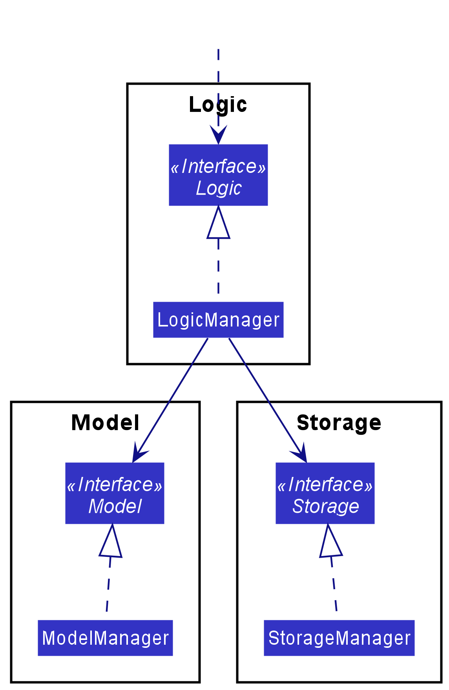

The sections below give more details of each component.

### UI component

The **API** of this component is specified in [`Ui.java`](https://github.com/AY2122S1-CS2103T-F12-4/tp/tree/master/src/main/java/seedu/address/ui/Ui.java)

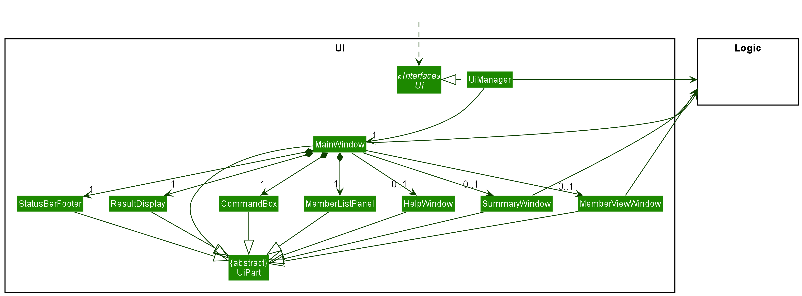

Structure of the UI Component MainWindow

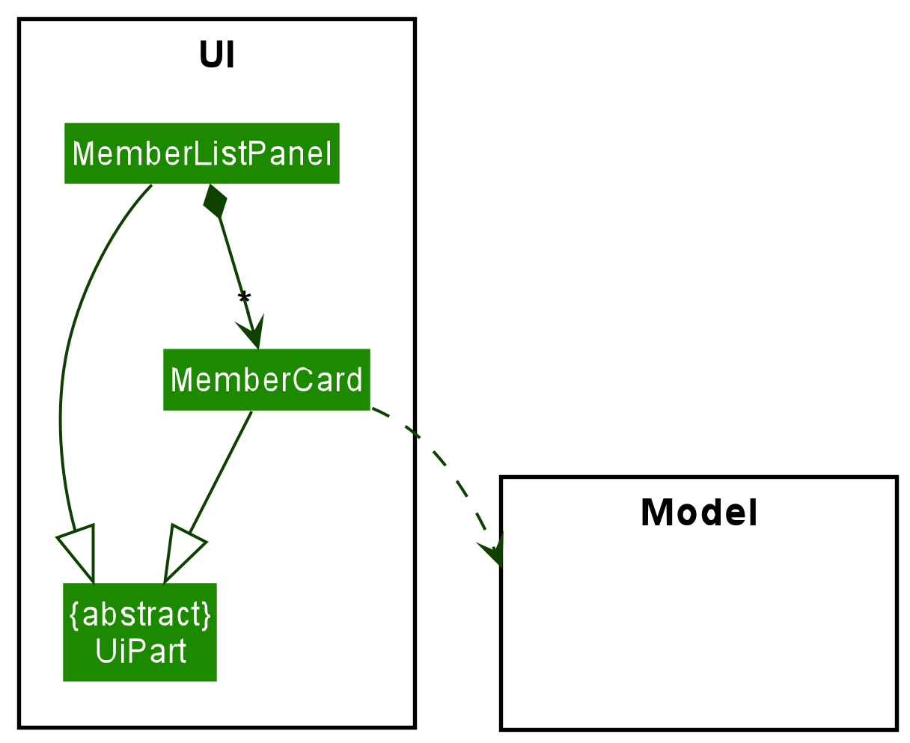

Structure of the UI Component MemberListPanel

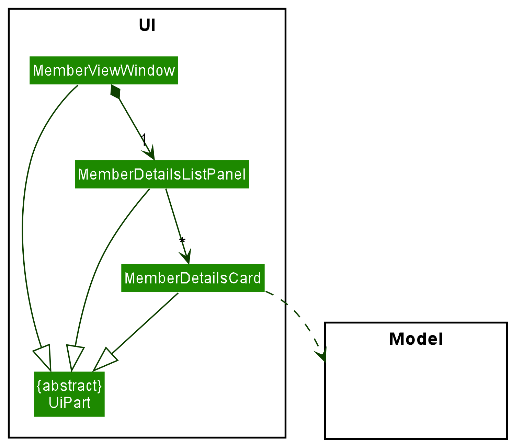

Structure of the UI Component MemberViewWindow

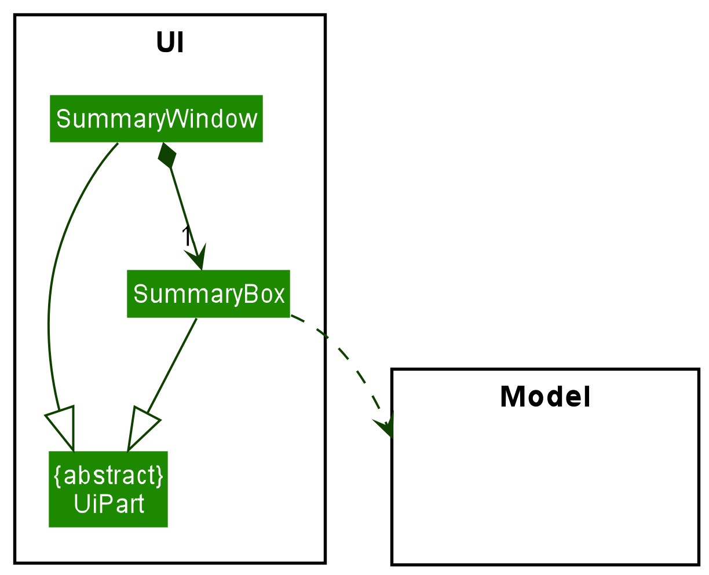

Structure of the UI Component SummaryWindow

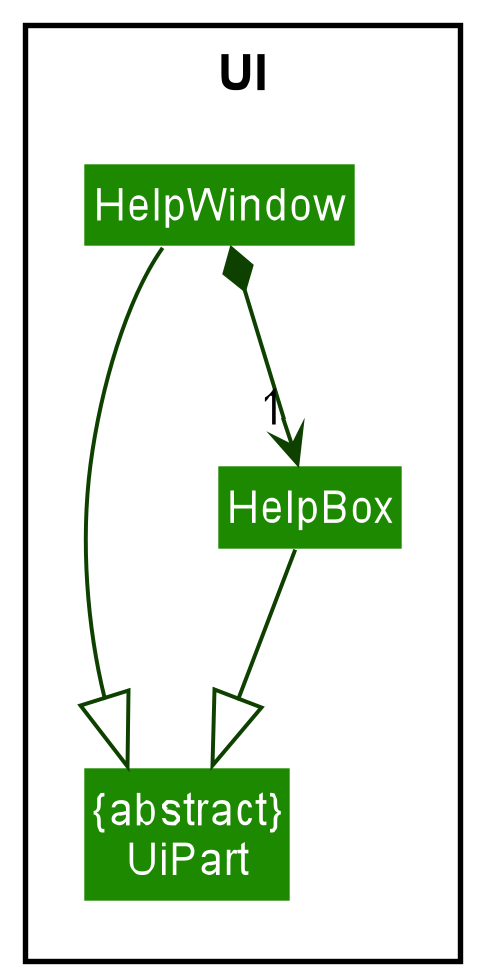

Structure of the UI Component HelpWindow

The UI consists of a `MainWindow` that is made up of parts e.g.`CommandBox`, `ResultDisplay`, `MemberListPanel`, `StatusBarFooter` etc. All these, including the `MainWindow`, inherit from the abstract `UiPart` class which captures the commonalities between classes that represent parts of the visible GUI.

The `UI` component uses the JavaFx UI framework. The layout of these UI parts are defined in matching `.fxml` files that are in the `src/main/resources/view` folder. For example, the layout of the [`MainWindow`](https://github.com/AY2122S1-CS2103T-F12-4/tp/tree/master/src/main/java/seedu/address/ui/MainWindow.java) is specified in [`MainWindow.fxml`](https://github.com/AY2122S1-CS2103T-F12-4/tp/tree/master/src/main/resources/view/MainWindow.fxml)

The `UI` component,

* executes user commands using the `Logic` component.
* listens for changes to `Model` data so that the UI can be updated with the modified data.
* keeps a reference to the `Logic` component, because the `UI` relies on the `Logic` to execute commands.
* depends on some classes in the `Model` component, as it displays `Member` object residing in the `Model`.

### Logic component

**API** : [`Logic.java`](https://github.com/AY2122S1-CS2103T-F12-4/tp/tree/master/src/main/java/seedu/address/logic/Logic.java)

Here's a (partial) class diagram of the `Logic` component:

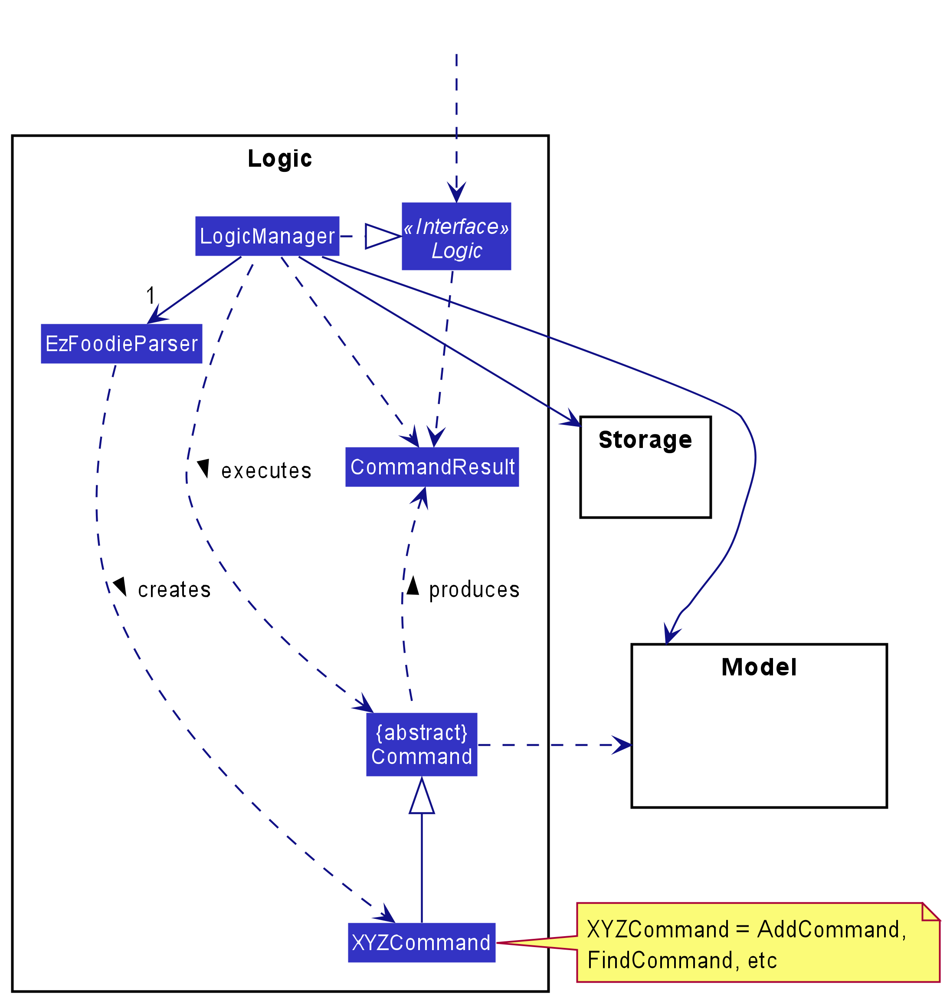

How the `Logic` component works:
1. When `Logic` is called upon to execute a command, it uses the `EzFoodieParser` class to parse the user command.
1. This results in a `Command` object (more precisely, an object of one of its subclasses e.g., `AddMemberCommand`) which is executed by the `LogicManager`.
1. The command can communicate with the `Model` when it is executed (e.g. to add a member).
1. The result of the command execution is encapsulated as a `CommandResult` object which is returned back from `Logic`.

The Sequence Diagram below illustrates the interactions within the `Logic` component for the `execute("del -mem/ -i/1")` API call.

:information_source: **Note:** The lifeline for `DeleteCommandPrefixParser`. `DeleteMemberCommandParser` and `DeleteMemberCommand` should end at the destroy marker (X) but due to a limitation of PlantUML, the lifeline reaches the end of diagram.

Here are the other classes in `Logic` (omitted from the class diagram above) that are used for parsing a user command:

How the parsing works:
* `UVW` is a placeholder for the specific type of the command e.g., `add`, `edit` and `redeem`
* `XYZ` is a placeholder for the specific object of the command e.g., `member`, `transaction` and `reservation`
* All `UVWXYZCommandParser` classes with the same type (e.g., `UVWMemberCommandParser`, `UVWTransactionCommandParser`, ...) extend from the `UVWCommandParser` abstract class so that they can be treated similarly where possible e.g, during testing.
* All `UVWXYZCommandParser` classes (e.g., `AddMemberCommandParser`, `DeleteMemberCommandParser`, ...) inherit from the `Parser` interface so that they can be treated similarly where possible e.g, during testing.

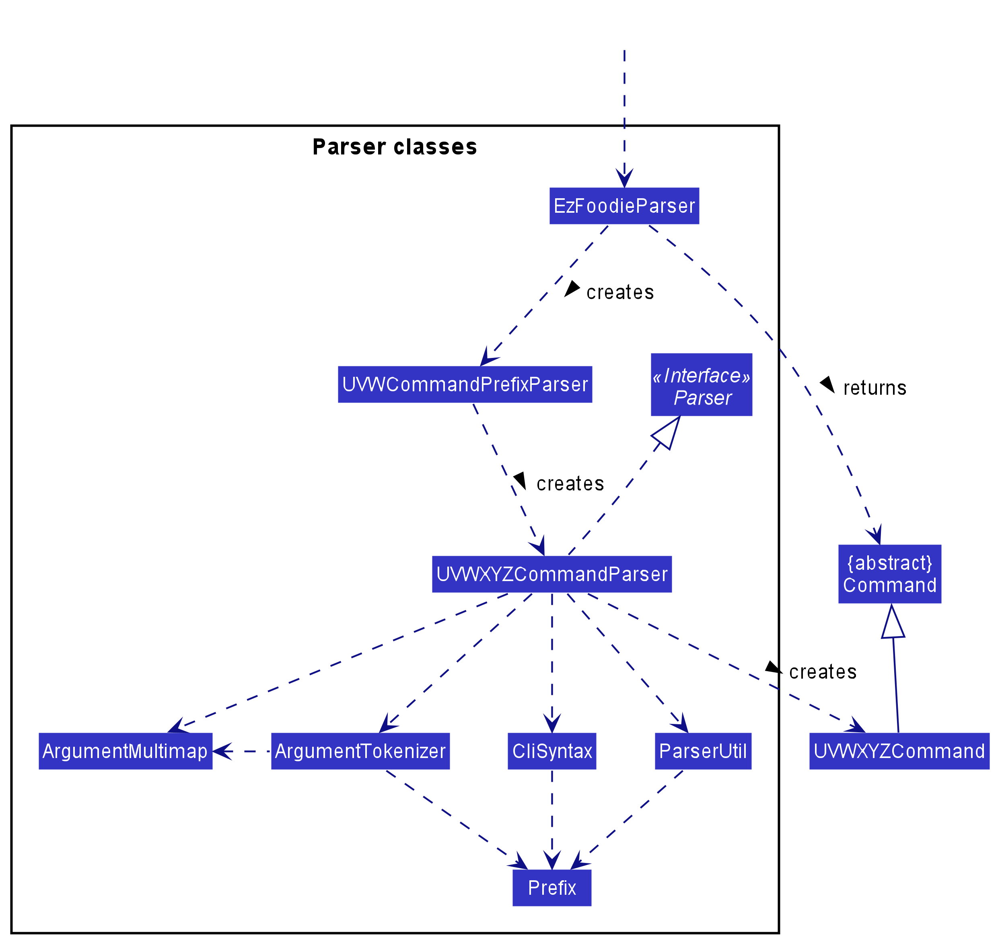

* Case1: `add`, `edit`, `redeem` and `delete` commands
  * When called upon to parse a user command, the `EzFoodieParser` class creates a `UVWCommandPrefixParser` (e.g., `AddCommandPrefixParser`) which uses the other classes shown above to parse the user command by the specific object of the command (e.g., `member`, `transaction` and `reservation` for `AddCommandParser` correspond to `AddMemberCommandParser`, `AddTransactionCommandParser` and `AddReservationCommandParser` respectively) and create a `UVWXYZCommandParser` which extends from `UVWXCommandParser` (e.g., `AddMmeberCommandParser` extends from `AddCommandParser`).
  * Then the `UVWXYZCommandParser` (e.g., `AddMmeberCommandParser`) uses the other classes shown above to parse the user command further and create a `UVWXYZCommand` object (e.g., `AddMmeberCommand`) which the `EzFoodieParser` returns back as a `Command` object.

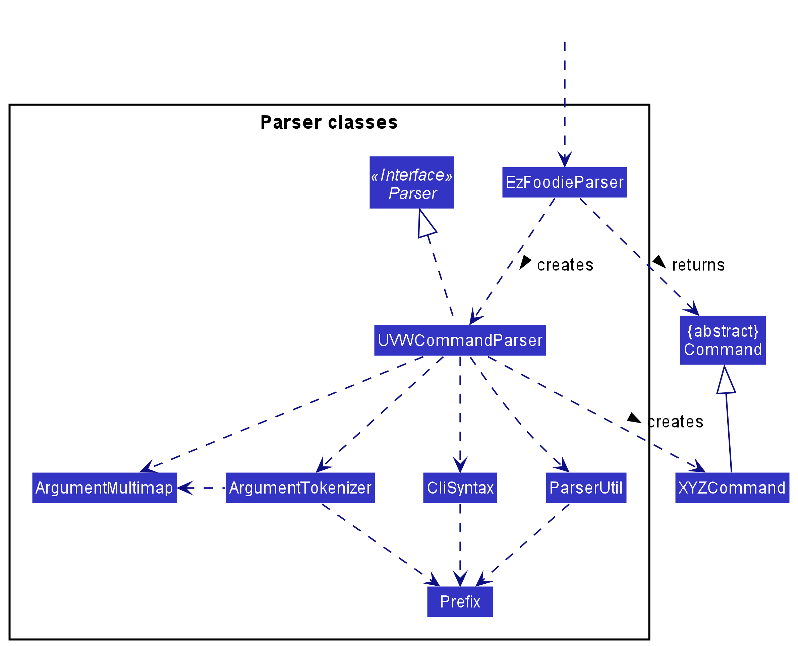

* Case2: `find`, `show`, `list`, `sort`, `login` and `setAccount` commands
  * When called upon to parse a user command, the `EzFoodieParser` class creates a `UVWCommandParser` (e.g., `FindCommandParser`) which uses the other classes shown above to parse the user command and create a `UVWCommand` object (e.g., `FindCommand`) which the `EzFoodieParser` returns back as a `Command` object.

 

* Case3: `clear`, `exit`, `logout`, `help` and `summary` commands
  * When called upon to parse a user command, the `EzFoodieParser` class creates a `UVWCommand` object directly (e.g., `ClearCommand`) which the `EzFoodieParser` returns back as a `Command` object.

### Model component
**API** : [`Model.java`](https://github.com/AY2122S1-CS2103T-F12-4/tp/tree/master/src/main/java/seedu/address/model/Model.java)

The `Model` component,

* stores the ezFoodie data i.e., all `Member` objects (which are contained in a `UniqueMemberList` object).
* stores the currently 'selected' `Member` objects (e.g., results of a search query) as a separate _filtered_ list which is exposed to outsiders as an unmodifiable `ObservableList<Member>` that can be 'observed' e.g. the UI can be bound to this list so that the UI automatically updates when the data in the list change.
* stores a `UserPref` object that represents the user’s preferences. This is exposed to the outside as a `ReadOnlyUserPref` objects.
* does not depend on any of the other three components (as the `Model` represents data entities of the domain, they should make sense on their own without depending on other components)

:information_source: **Note:** An alternative (arguably, a more OOP) model is given below. It has a `Reservation` list in the `EzFoodie`, which `Member` references. This allows `EzFoodie` to only require one `Reservation` object per unique reservation, instead of each `Member` needing their own `Reservation` objects. 

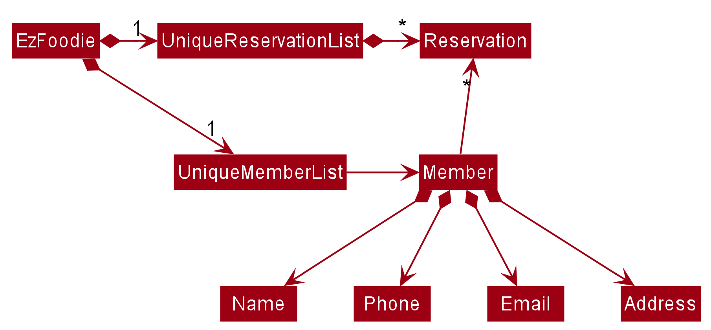

### Storage component

**API** : [`Storage.java`](https://github.com/AY2122S1-CS2103T-F12-4/tp/tree/master/src/main/java/seedu/address/storage/Storage.java)

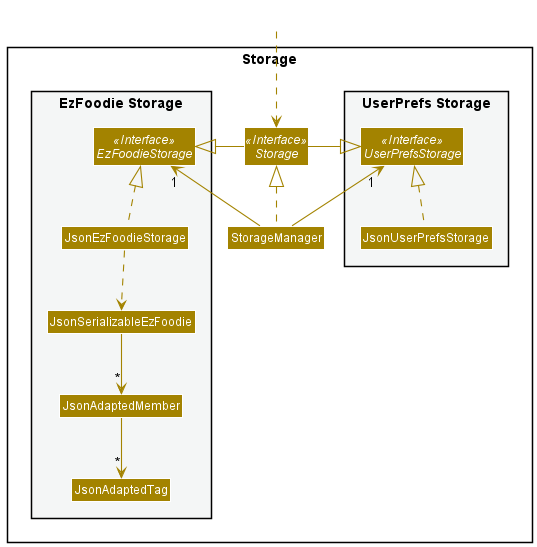

The `Storage` component,
* can save both ezFoodie data and user preference data in json format, and read them back into corresponding objects.
* inherits from `AccountStorage`, `EzFoodieStorage` and `UserPrefStorage`, which means it can be treated as either one (if only the functionality of only one is needed).
* depends on some classes in the `Model` component (because the `Storage` component's job is to save/retrieve objects that belong to the `Model`)

### Common classes

Classes used by multiple components are in the `seedu.address.commons` package.

--------------------------------------------------------------------------------------------------------------------

## **Implementation**

This section describes some noteworthy details on how certain features are implemented.

### Find feature

`[written by: Hu Jiajun]`

#### Implementation

Given below is an example usage scenario and how the find mechanism behaves at each step.

1. The user executes `find -mem/ -id/00001` command to find the member with the member id `00001` in the application.

2. The command is handled by `LogicManager#execute(String)`, which then calls and passes this command to the `EzFoodieParser#parseCommand(String)` method.

3. The `EzFoodieParser` detects the command word `find` in the string and extracts the argument string `-mem/ -id/00001`.

4. The `EzFoodieParser` creates a new `FindCommandParser` instance to parse the argument string according to the format specified for `FindCommand`.

5. The argument string is parsed to the member ids array `[00001]` using the `FindCommandParser#parse(String)` method, which also performs validation.

6. The `FindCommandParser` creates a new `IdContainsKeywordsPredicate` instance with the member ids array `[00001]` to handle the filter.

7. The `FindCommandParser` creates a new `FindCommand` instance with the `IdContainsKeywordsPredicate` instance and returns it to `EzFoodieParser`, which in turn returns it to `LogicManager`.

8. The `LogicManager` calls the `FindCommand#execute(Model)` method.

9. The `FindCommand` calls the `Model#updateFilteredMemberList(IdContainsKeywordsPredicate)` method.

10. The `Model` calls the `FilteredList#setPredicate(IdContainsKeywordsPredicate)` to filter the member by the member id `00001`

11. The application lists the filtered member.

12. Lastly, the `FindCommand` creates a `CommandResult` with a `SuccessMessage` and returns it to `LogicManager`.

The above process is shown in the following sequence diagram:

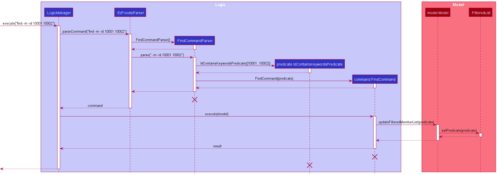

**Sequence diagram showcasing the find command process**

:information_source: **Note:** The lifeline for `FindCommandParser`, `IdContainsKeywordsPredicate` and `FindCommand` should end at the destroy marker (X) but due to a limitation of PlantUML, the lifeline reaches the end of diagram.

The following activity diagram summarizes what happens when a user executes a new command to find the members by keywords:

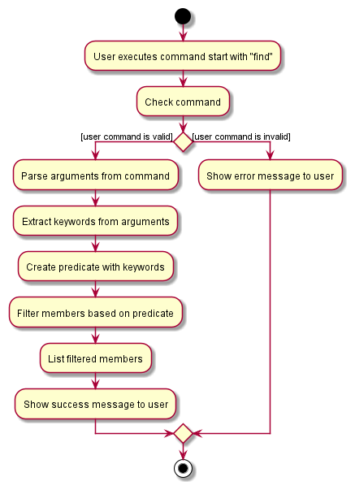

**Activity diagram showcasing the find command execution flow**

#### Design consideration

**Aspect: How to execute different types of keywords with `FindCommand`**

* **Alternative 1 (current choice):** Add corresponding constructors for different types of keywords.
  * Pros: Easy to implement, only need to make a few changes to the source code.
  * Cons: Insufficient use of object-oriented features (inheritance and polymorphic).

* **Alternative 2:** Abstract `FindCommand`, create different classes according to different types of keywords to inherit `FindCommand`, such as `FindIdCommand`, `FindNameCommand`, `FindEmailCommand`, etc.
  * Pros: Sufficient use of object-oriented features (inheritance and polymorphic).
  * Cons: Have to make more changes to the source code, it may cause potential bugs.

### Sort feature

`[written by: Hu Jiajun]`

#### Implementation

Given below is an example usage scenario and how the sort mechanism behaves at each step.

1. The user executes `sort -mem/ -c/ -a/` command to sort the members by their credits in ascending order in the application.

2. The command is handled by `LogicManager#execute(String)`, which then calls and passes this command to the `EzFoodieParser#parseCommand(String)` method.

3. The `EzFoodieParser` detects the command word `sort` in the string and extracts the argument string `-mem/ -c/ -a/`.

4. The `EzFoodieParser` creates a new `SortCommandParser` instance to parse the argument string according to the format specified for `SortCommand`.

5. The argument string is parsed to `a` (ascending order) and converted to the enum tpye `SortStatus.ASC` using the `SortCommandParser#parse(String)` method, which also performs validation.

6. The `SortCommandParser` creates a new `CreditSortComparator` instance with the enum tpye `SortStatus.ASC` to handle the sort.

7. The `SortCommandParser` creates a new `SortCommand` instance with the `CreditSortComparator` instance and returns it to `EzFoodieParser`, which in turn returns it to `LogicManager`.

8. The `LogicManager` calls the `SortCommand#execute(Model)` method.

9. The `SortCommand` calls the `Model#updateSortedMemberList(CreditSortComparator)` method.

10. The `Model` calls the `SortedList#setComparator(CreditSortComparator)` method to sort the members by their credits in ascending order

11. The application lists the sorted members.

12. Lastly, the `SortCommand` creates a `CommandResult` with a `SuccessMessage` and returns it to `LogicManager`.

The above process is shown in the following sequence diagram:

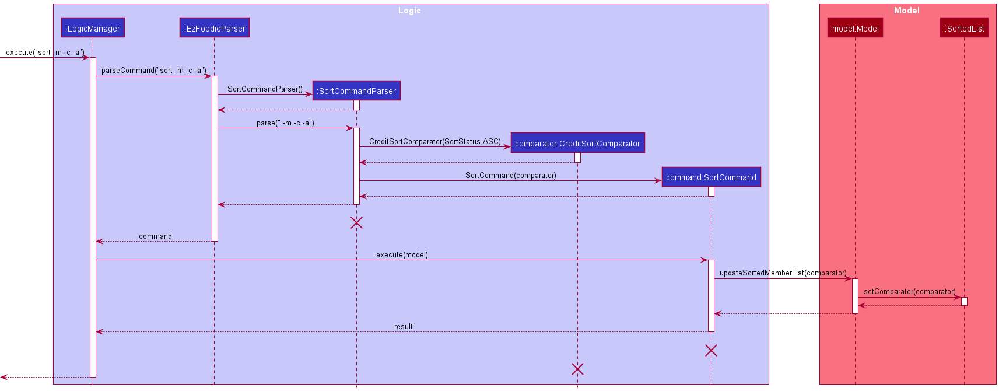

**Sequence diagram showcasing the sort command process**

:information_source: **Note:** The lifeline for `SortCommandParser`, `CreditSortComparator` and `SortCommand` should end at the destroy marker (X) but due to a limitation of PlantUML, the lifeline reaches the end of diagram.

The following activity diagram summarizes what happens when a user executes a new command to sort the members by their credits:

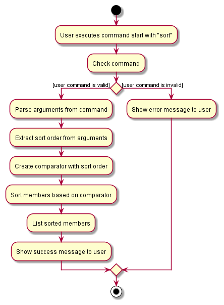

**Activity diagram showcasing the sort command execution flow**

#### Design consideration

**Aspect: How to sort by different types of fields with `SortCommand`**

* **Alternative 1 (current choice):** Add corresponding constructors for different types of fields.
  * Pros: Easy to implement, only need to make a few changes to the source code.
  * Cons: Insufficient use of object-oriented features (inheritance and polymorphic).

* **Alternative 2:** Abstract `SortCommand`, create different classes according to different types of fields to inherit `SortCommand`, such as `SortPointCommand`, `SortCreditCommand`, etc.
  * Pros: Sufficient use of object-oriented features (inheritance and polymorphic).
  * Cons: Have to make more changes to the source code, it may cause potential bugs.

### Add Transaction feature

`[written by: Yang Yuzhao]`

#### Implementation

Given below is an example usage scenario and how adding transaction behaves at each step.

1. The user executes `add -txn/ -b/23.00 -id/00001` command to add a transaction of billing amount `23.00` to the member with member ID `00001` in ezFoodie.

2. The command is handled by `LogicManager#execute(String)`,
   which then calls and passes this command to the `EzFoodieParser#parseCommand(String)` method.

3. The `EzFoodieParser` detects the command word `add` in the string and extracts the argument string `-txn/ -b/23.00 -id/00001`.

4. The `EzFoodieParser` creates a new `AddCommandPrefixParser` instance to parse the argument string
   according to the format specified for `AddCommand`.

5. The `AddCommandPrefixParser` detects the prefix word `-txn/` by the method `AddCommandPrefixParser#parse(arguments)`
   called and creates a new `AddTransactionCommandParser` instance to parse the rest of the argument string.

6. The `AddTransactionCommandParser`prefixes `-b/` and `-id/`
   by the method `AddTransactionCommandParser#parser(arguments)` called
   nd parse them into `billing` and `memberId` through `ParserUtil#parseBilling` and `ParserUtil#parseMemberId`.

7. The `AddTransactionCommandParser#parser(arguments)` calls `ParserUtil#parseTimestamp`
   to create a new `TimeStamp` instance `timestamp` and
   `ParserUtil#parseTransactionId` to create a new `Id` instance `transactionId`,
   and creates a new `Transaction` object `transaction` with `billing`, `timestamp` and `transactionId`.

8. The `AddTransactionCommandParser#parser(arguments)` creates a new `AddTransactionCommand` instance
   with `transaction` and `memberId` and returns it to `ezFoodieParser` which in turn returns it to `LogicManager`.

9. The `LogicManager` calls the `AddTransactionCommand#execute(Model)` method.

10. The `AddTransactionCommand` calls `Model#getUpdatedMemberList()` and
    searches the list to find the member with the respective `memberID` to obtain `memberToEdit`.

11. The `AddTransactionCommand` calls `AddTransactionCommand#createEditedMember(memberToedit, transaction)`
    to obtain `editedMember`.

12. The `AddTransactionCommand` calls `Model#setMember(memberToEdit, editedMember)`
    to replace the old member with new transaction details.

13. The `AddTransactionCommand` calls `Model#updateFilteredMemberList(PREDICATE_SHOW_ALL_MEMBERS)` to update the edited
    member in the member list.

14. The application lists the updated member list.

15. Lastly, the `AddTransactionCommand` creates a new instance of `CommandResult` with a success message,
    and returns it to `LogicManager`.

The above process is shown in the following sequence diagram:

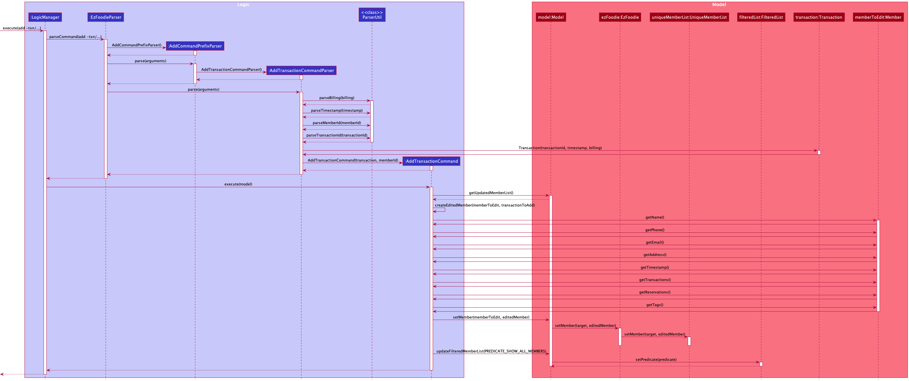

### Show Member Profile feature

`[written by: Yang Yuzhao]`

#### Implementation

Given below is an example usage scenario and how showing member profile behaves at each step.

1. The user executes `show -mem/ -id/00001` command to show the details of member with member ID `00001` in ezFoodie
   in a separate window.

2. The command is handled by `LogicManager#execute(String)`,
   which then calls and passes this command to the `EzFoodieParser#parseCommand(String)` method.

3. The `EzFoodieParser` detects the command word `show` in the string and extracts the argument string `-mem -id/00001`.

4. The `EzFoodieParser` creates a new `ViewCommandParser` instance to parse the argument string
   according to the format specified for `ViewCommand`.

5. `ViewCommandParser` calls `ViewCommandParser#parse()` to parse the arguments into a new `Id` instance `id`
   using `ParserUtil#parseMemberId(String)`.

6. A new String array `idKeywords` is created by `value` attribute of `id`.

7. `ViewCommandParser` creates a new `ViewCommand` instance with
   a new `IdContainsKeywordsPredicate` created using `idKeywords` and
   returns it to `ezFoodieParser` which in turn returns it to `LogicManager`.

8. The `LogicManager` calls the `ViewCommand#execute(Model)` method.

9. The `ViewCommand` calls `Model#updateFilteredMemberListForView(IdContainsKeywordsPredicate)`
   to update the `filteredMembersForView` in `ModelManager` with filtered member to show.

10. The `ViewCommand` creates a new instance of `CommandResult` with a success message
    and a true value for `showMemberView`, and returns it to `LogicManager`.

11. The application opens a separate `MemberViewWindow` with this member's profile.

### Summary feature

`[written by: Yang Yuzhao]`

#### Implementation

Given below is an example usage scenario and how showing summary behaves at each step.

1. The user executes `summary` command to show statistics about `Member` existing in ezFoodie
   as well as time-series statistics of `Transaction` data.

2. The command is handled by `LogicManager#execute(String)`,
   which then calls and passes this command to the `EzFoodieParser#parseCommand(String)` method.

3. The `EzFoodieParser` detects the command word `summary` in the string.

4. `LoginStatus.getLoginStatus()` is called to check whether the user has logged in as a manager.
   If not, a new `PermissionException` instance will be thrown with `MESSAGE_PERMISSION_DENIED`.

5. If the user has logged in as a manager, `EzFoodieParser` creates a new `SummaryCommand` instance
   and returns it to `ezFoodieParser` which in turn returns it to `LogicManager`.

6. The `LogicManager` calls the `SummaryCommand#execute(Model)` method.

7. The `ViewCommand` creates a new instance of `CommandResult` with a success message
   and a true value for `showSummary`, and returns it to `LogicManager`.

8. The application opens a separate `SummaryWindow` with statistics to show.

The above process is shown in the following sequence diagram:

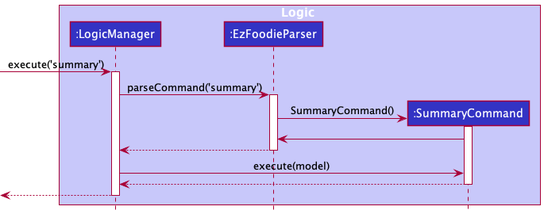

### Add member feature

`[written by: Zhang Zhiyao]`

#### Implementation

Given below is an example usage scenario and how the adding members behaves at each step.

1. The user executes `add -mem/ -n/John Doe -p/98765432 -e/johndoe@gmail.com -a/112 Amoy Street, 069907, Singapore` command to add a member `John Doe` in the Ezfoodie and its' storage.

2. The command is handled by `LogicManager#execute(String)`, which then calls and passes this command to the `EzFoodieParser#parseCommand(String)` method.

3. The EzFoodieParser detects the command word `add` in the string and extracts the argument string 
    `-mem/ -n/John Doe -p/98765432 -e/johndoe@gmail.com -a/112 Amoy Street, 069907, Singapore`.

4. The `EzFoodieParser` creates a new `AddCommandPrefixParser` instance to parse the argument string according to the format specified for `AddCommand` and calls `AddCommandPrefixParser#parse(arguments)`.

5. `AddCommandPrefixParser#parse(arguments)` detects the prefix `-mem/` and creates a new instance of  `AddMemberCommandParser` and calls `AddMemberCommandParser#parse(arguments)`.

6. `AddMemberCommandParser#parse(arguments)` detects the prefixes `-n/`, `-p/`, `-e/` and `-a/`  and parses them through `ParseUtil` to obtain the `name`, `phone`,`email` and `address`. 

7. Through the `ParseUtil`, it will get default `timestamp`, `credit`, `point`, `tagList`, `transactionList` and `reservationList`.

7. Using the obtained `name`, `phone`,`email`, `address`, `timestamp`, `credit`,`point`, `tagList`, `transactionList` and `reservationList`. a new instance of `Member` is created.

8. Using a new instance `Member`, a new instance of `AddMemberCommand` is created and returned to `ezFoodieParser` which in turn returns it to `LogicManager`.

9. `LogicManager` calls the `AddMemberCommand#execute(Model)` method.

10.  Lastly, `AddMemberCommand` creates a new instance of `CommandResult` with a success message, and returns it to Logic Manager.

#### Design consideration

**What is the default value of `timestamp` ?**
* **default value** is the timestamp auto registerred by system at fist time add in the member.

**What is the default value of `credit`,`point`, `tagList`, `transactionList` and `reservationList` ?**
* **default value** will all be set as 0 and empty list.

### Update Credit feature

`[written by: Zhang Zhiyao]`

#### Implementation

Given below is an example usage scenario and how the redeem mechanism behaves at each step.

1. The user executes `add -txn/ -b/200.00 -id/00001` command to add transaction.

2. The command is handled by `LogicManager#execute(String)`, which then calls and passes this command to the `EzFoodieParser#parseCommand(String)` method.

3. The EzFoodieParser detects the command word `add` in the string and extracts the argument string `-txn/ -b/200.00 -id/00001`.

4. The EzFoodieParser creates a new `AddCommandPrefixParser` instance to parse the argument string according to the format specified for `AddCommand` and calls `AddCommandPrefixParser#parse(arguments)`.

5. `AddCommandPrefixParser#parse(arguments)` detects the prefix `-txn/` and creates a new instance of `AddTransactionCommandParser` and calls `AddTransactionCommandParser#parse(arguments)`.

6. `AddTransactionCommandParser#parse(arguments)` detects the prefixes `-b/` and ` -id/` and parses them through `ParseUtil` to obtain the `billing amount` and the `memberID`.

7. Using the obtained `billing amount`, a new instance of `Transaction` is created. According to the `billing amount`, the credit has been updated.

### Redeem point feature

`[written by: Zhang Zhiyao]`

#### Implementation

Given below is an example usage scenario and how the redeem mechanism behaves at each step.

1. when user redeem point, the user executes `redeem -rd/100 -id/00001` command。

2. The command is handled by `LogicManager#execute(String)`, which then calls and passes this command to the `EzFoodieParser#parseCommand(String)` method.

3. The EzFoodieParser detects the command word `redeem` in the string and extracts the argument string `-rd/100 -id/00001`.

4. The EzFoodieParser creates a new `RedeemCommandParser` instance to parse the argument string according to the format specified for `RedeemCommand`, and calls `RedeemCommandParser`. 

5. The `RedeemCommandParser` detects the prefixes `-b/`, `-id/` and parses them through `ParseUtil` to obtain the `billing amount`, the `memberID`.

6. Using the obtained `billing amount`, the `RedeemCommand` will execute and update related point. then return a  new `Member` with updated point.

### Add reservation
`[written by: Raja Sudalaimuthu Mukund]`

#### Implementation

Given below is an example usage scenario and how the add reservation mechanism behaves at each step.

1. The user executes `add -rs/ -dt/2021-01-01 00:00 -rm/2 people -id/10001` command to add a reservation for 2 people at
    2021-01-01 00:00 hrs to member id 10001's reservation list.

2. The command is handled by `LogicManager#execute(String)`, which then calls and passes this command to the `EzFoodieParser#parseCommand(String)` method.

3. The EzFoodieParser detects the command word `add` in the string and extracts the argument string `-rs/ -dt/2021-01-01 00:00 -rm/2 people -id/10001`.

4. The EzFoodieParser creates a new `AddCommandPrefixParser` instance to parse the argument string according to the format specified for `AddCommand` and calls `AddCommandPrefixParser#parse(arguments)`.

5. `AddCommandPrefixParser#parse(arguments)` detects the prefix `-rs/` and creates a new instance of `AddReservationCommandParser` and calls `AddReservationCommandParser#parse(arguments)`.

6. `AddReservationCommandParser#parse(arguments)` detects the prefixes `-dt/`, `-rm/` and `-id/` and parses them through `ParseUtil` to obtain the `dateTime`, `remark` and the `memberID`.

7. Using the obtained `dateTime` and `remark`, a new instance of `Reservation` is created.

8. Using the new instance of `Reservation` and the obtained `memberID`, a new instance of `AddReservationCommand` is created and returned to 
    ezFoodieParser which in turn returns it to `LogicManager`.

9. `LogicManager` calls the `AddReservationCommand#execute(Model)` method.

10. The `AddReservationCommand` calls `Model#getUpdatedMemberList()` and searches the list to find the member with the respective `memberID` to obtain `memberToEdit`.

11. The `AddReservationCommand` calls `Model#createUpdatedReservations(memberToEdit, reservationToAdd)` to create a new 
    instance of the same member but with the new reservation added to the member's reservation list.

12. The `AddReservationCommand` calls `Model#setMember(memberToEdit, editedMember)` to replace the old instance of the member
    with its new instance.

13. The `AddReservationCommand` calls `Model#updateFilteredMemberList(PREDICATE_SHOW_ALL_MEMBERS)` to update the current
    member list with the updated member list.

14. The application lists the updated member list.

15. Lastly, `AddReservationCommand` creates a new instance of `CommandResult` with a success message, and returns it to Logic Manager.

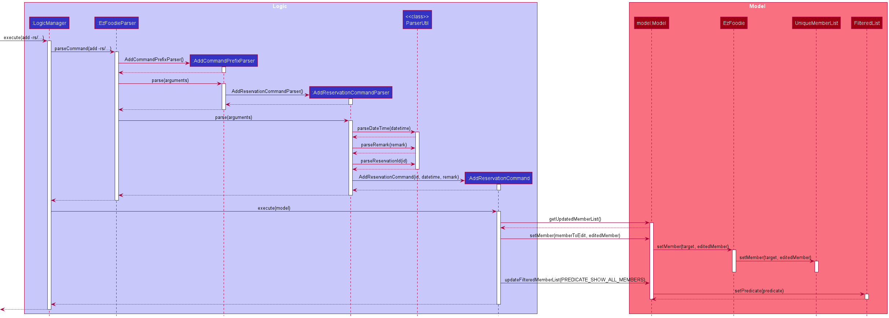

#### Design consideration

### Delete Reservation Feature

`[written by: Chen Shi Yao, Stephanie]`

#### Implementation

Given below is an example usage scenario and how the delete reservation mechanism behaves at each step.

1. The user executes `del -rs/ -id/10001100001` command to delete the reservation with reservationId 100001 for the
    member with ID 10001.

2. The command is handled by `LogicManager#execute(String)`, which then calls and passes this command to the
   `EzFoodieParser#parseCommand(String)` method.

3. The EzFoodieParser detects the command word `del` in the string and extracts the argument string
   `-rs/ -id/10001100001`.

4. The EzFoodieParser creates a new `DeleteCommandPrefixParser` instance to parse the argument string according to the
   format specified for `DeleteCommand` and calls `DeleteCommandPrefixParser#parse(arguments)`.

5. `DeleteCommandPrefixParser#parse(arguments)` detects the prefix `-rs/` and creates a new instance of
   `DeleteReservationCommandParser` and calls `DeleteReservationCommandParser#parse(arguments)`.

6. `DeleteReservationCommandParser#parse(arguments)` detects the prefixes `-id/` and parses them through
   `ParseUtil` to obtain the `memberId` and `ReservationId`.

7. Using the obtained `memberID` and `ReservationId`, a new instance of `DeleteReservationCommand` is created and returned to
   ezFoodieParser which in turn returns it to `LogicManager`. 

8. `LogicManager` calls the `DeleteReservationCommand#execute(Model)` method.

9. The `DeleteReservationCommand` calls `Model#getUpdatedMemberList()` and searches the list to find the member with the respective
    `memberID` to obtain `memberToEdit`.
   
10. Using the `reservationId`, the `DeleteReservationCommand` then searches the list of `Reservations` associated with the 
    `memberToEdit` to find the `reservationToDelete`.

11. The `DeleteReservationCommand` calls `DeleteReservationCommand#createEditedMember(memberToEdit, reservationToDelete)` to create a new
    instance of the same member but with the reservation deleted from the member's reservation list.

12. The `DeleteReservationCommand` calls `Model#setMember(memberToEdit, editedMember)` to replace the old instance of the member
    with its new instance.

13. The `DeleteReservationCommand` calls `Model#updateFilteredMemberList(PREDICATE_SHOW_ALL_MEMBERS)` to update the current
    member list with the updated member list.

14. The application lists the updated member list.

15. Lastly, `DeleteReservationCommand` creates a new instance of `CommandResult` with a success message, and returns it to Logic Manager.

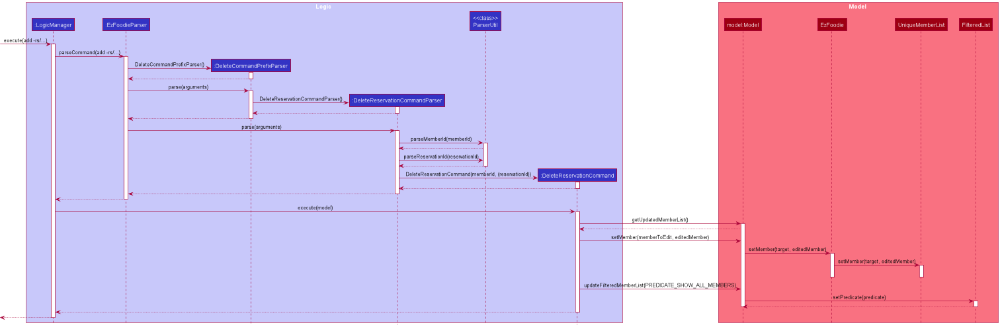

<label id=udordo></label>
### \[Proposed\] Undo/redo feature

#### Proposed Implementation

The proposed undo/redo mechanism is facilitated by `VersionedEzFoodie`. It extends `EzFoodie` with an undo/redo history, stored internally as an `ezFoodieStateList` and `currentStatePointer`. Additionally, it implements the following operations:

* `VersionedEzFoodie#commit()` — Saves the current ezFoodie state in its history.
* `VersionedEzFoodie#undo()` — Restores the previous ezFoodie state from its history.
* `VersionedEzFoodie#redo()` — Restores a previously undone ezFoodie state from its history.

These operations are exposed in the `Model` interface as `Model#commitEzFoodie()`, `Model#undoEzFoodie()` and `Model#redoEzFoodie()` respectively.

Given below is an example usage scenario and how the undo/redo mechanism behaves at each step.

Step 1. The user launches the application for the first time. The `VersionedEzFoodie` will be initialized with the initial ezFoodie state, and the `currentStatePointer` pointing to that single ezFoodie state.

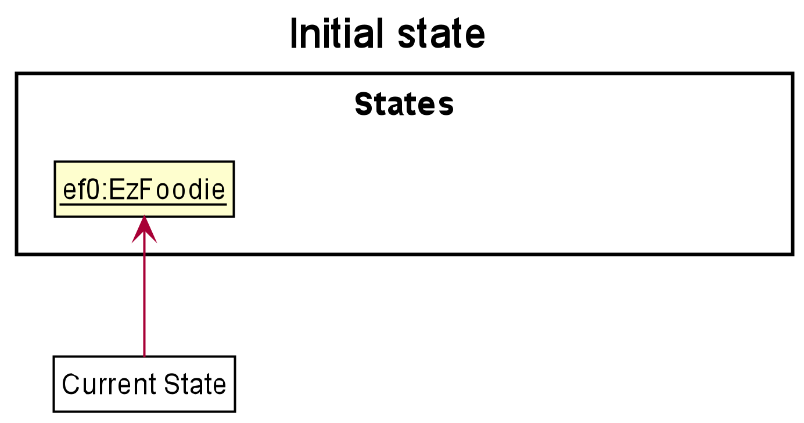

Step 2. The user executes `del -mem/ -i/5` command to delete the 5th Member in the ezFoodie. The `delete` command calls `Model#commitEzFoodie()`, causing the modified state of the ezfoodie after the `del -mem/ -i/5` command executes to be saved in the `ezFoodieStateList`, and the `currentStatePointer` is shifted to the newly inserted ezFoodie state.

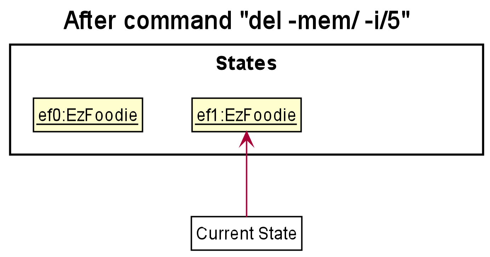

Step 3. The user executes `add -mem/ -n/John Doe …​` to add a new member. The `add` command also calls `Model#commitEzFoodie()`, causing another modified ezFoodie state to be saved into the `ezFoodieStateList`.

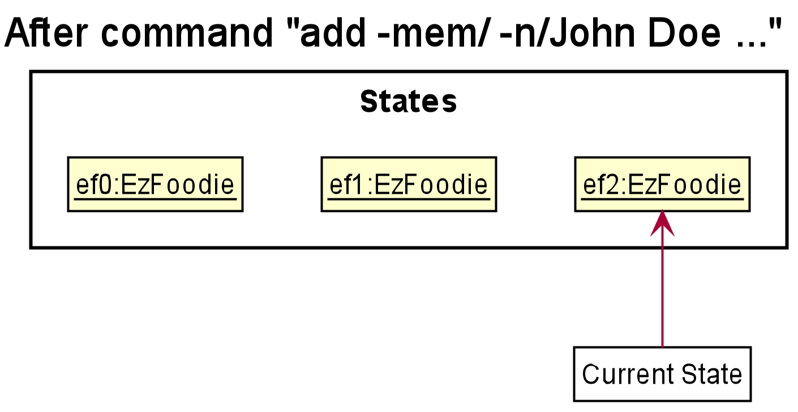

:information_source: **Note:** If a command fails its execution, it will not call `Model#commitEzFoodie()`, so the ezFoodie state will not be saved into the `ezFoodieStateList`.

Step 4. The user now decides that adding the member was a mistake, and decides to undo that action by executing the `undo` command. The `undo` command will call `Model#undoEzFoodie()`, which will shift the `currentStatePointer` once to the left, pointing it to the previous ezFoodie state, and restores the ezFoodie to that state.

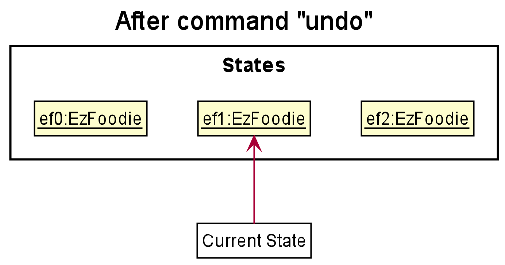

:information_source: **Note:** If the `currentStatePointer` is at index 0, pointing to the initial EzFoodie state, then there are no previous EzFoodie states to restore. The `undo` command uses `Model#canUndoEzFoodie()` to check if this is the case. If so, it will return an error to the user rather than attempting to perform the undo.

The following sequence diagram shows how the undo operation works:

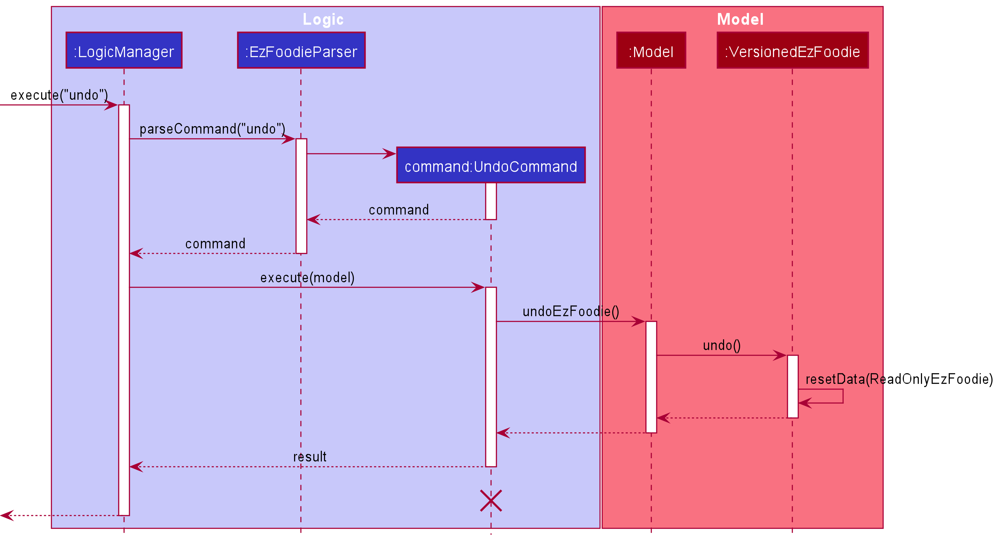

:information_source: **Note:** The lifeline for `UndoCommand` should end at the destroy marker (X) but due to a limitation of PlantUML, the lifeline reaches the end of diagram.

The `redo` command does the opposite — it calls `Model#redoEzFoodie()`, which shifts the `currentStatePointer` once to the right, pointing to the previously undone state, and restores the ezFoodie to that state.

:information_source: **Note:** If the `currentStatePointer` is at index `ezFoodieStateList.size() - 1`, pointing to the latest ezFoodie state, then there are no undone EzFoodie states to restore. The `redo` command uses `Model#canRedoEzFoodie()` to check if this is the case. If so, it will return an error to the user rather than attempting to perform the redo.

Step 5. The user then decides to execute the command `list -mem/`. Commands that do not modify the ezFoodie, such as `list -mem/`, will usually not call `Model#commitEzFoodie()`, `Model#undoEzFoodie()` or `Model#redoEzFoodie()`. Thus, the `ezFoodieStateList` remains unchanged.

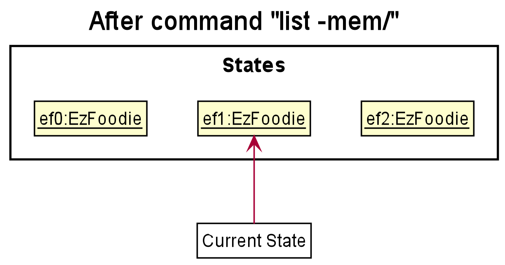

Step 6. The user executes `clear`, which calls `Model#commitEzFoodie()`. Since the `currentStatePointer` is not pointing at the end of the `ezFoodieStateList`, all ezFoodie states after the `currentStatePointer` will be purged. Reason: It no longer makes sense to redo the `add -mem/ -n/John Doe …​` command. This is the behavior that most modern desktop applications follow.

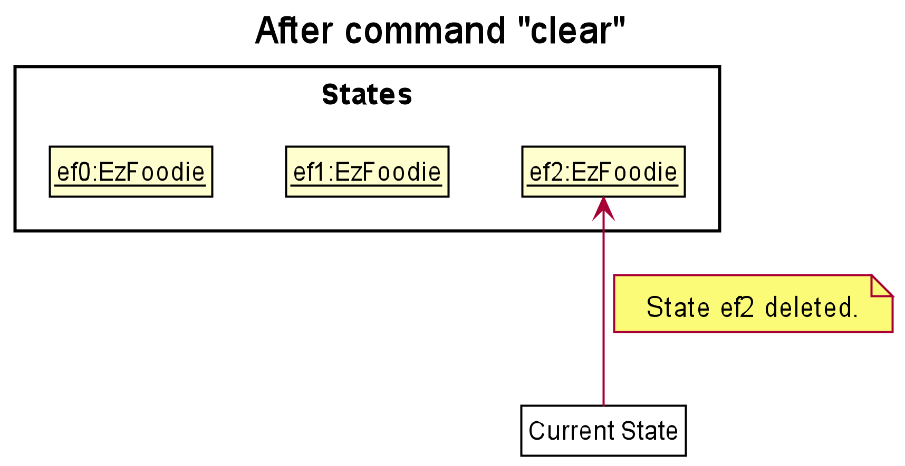

The following activity diagram summarizes what happens when a user executes a new command:

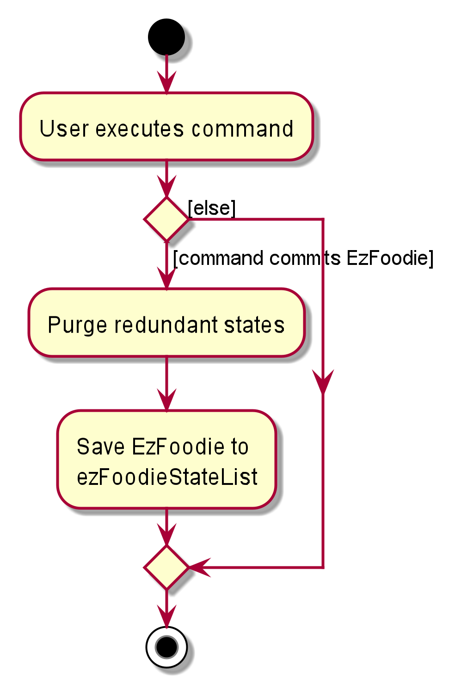

#### Design considerations

**Aspect: How undo & redo executes:**

* **Alternative 1 (current choice):** Saves the entire ezFoodie.
  * Pros: Easy to implement.
  * Cons: May have performance issues in terms of memory usage.

* **Alternative 2:** Individual command knows how to undo/redo by itself.
  * Pros: Will use less memory (e.g. for `delete`, just save the member being deleted).
  * Cons: We must ensure that the implementation of each individual command are correct.

_{more aspects and alternatives to be added}_

### \[Proposed\] Data archiving

_{Explain here how the data archiving feature will be implemented}_

--------------------------------------------------------------------------------------------------------------------

## **Documentation, logging, testing, configuration, dev-ops**

* [Documentation guide](Documentation.md)
* [Testing guide](Testing.md)
* [Logging guide](Logging.md)
* [Configuration guide](Configuration.md)
* [DevOps guide](DevOps.md)

--------------------------------------------------------------------------------------------------------------------

## **Appendix 1: Requirements**

### Product scope

**Target user profile story**:

Ben is a restaurant manager. He found that restaurants are becoming more and more popular, the number of members is increasing, and there are a large number of reservations every day. Every day the front desk staffs spend a lot of time in excel or paper to record new members, record reservations, and find reservations. With the need to handle multiple tasks at the same time, the staffs are also prone to make careless mistakes at work due to fatigue. 😞

More importantly, the member list is only stored in excel, it makes it difficult for Ben to manage and analyze members to formulate targeted promotional strategies, which will have bad impact on the profit expansion of the restaurant. 😞

As a manager who is proficient in technology and has commendable experience in Unix, Ben hopes to develop an easy-to-operate application to improve the work efficiency of himself and the staffs. 🤩

**Target user profile summary**:

Managers and staffs who

* work in a highly popular restaurant and the number of members is increasing
* are responsible for managing a large number of member registrations and reservations daily
* are required to multi-task (manage member registrations and reservations)
* need automatic reminder
* need to manage and analyze members to formulate promotional strategies
* are proficient in technology
* want to get things done quickly
* are tired of tracking member details from paper or excel
* prefer desktop apps over other types
* can type fast
* prefer typing to mouse interactions
* are reasonably comfortable using CLI apps

**Value proposition**: 

helps restaurants keep track of their ever-growing list of members. Restaurant managers and staffs can easily view and update member status (e.g. personal information, tier, reservation, transaction, etc.) to manage and analyze members based on various criteria faster than a typical mouse/GUI driven application.

### User stories

Priorities: High (must have) - `* * *`, Medium (nice to have) - `* *`, Low (unlikely to have) - `*`

| Priority | As a …​  | I want to …​                                               | So that I can …​                                                        |
| -------- | --------| --------------------------------------------------------- | ---------------------------------------------------------------------- |
| `* * *`  | staff   | view help                                                 | easily check how to use the commands and access the user guide         |
| `* * *`  | staff   | exit the program                                          |                                                                        |
| `* * *`  | staff   | list out all members                                      | easily view and access the member basic information                    |
| `* * *`  | staff   | add new member                                            | easily the track member statuses                                       |
| `* * *`  | staff   | find members by name                                      | easily find the specific members to check their details                |
| `* * *`  | staff   | find member by phone                                      | easily find the specific member to check his/her details               |
| `* * *`  | staff   | find member by email                                      | easily find the specific member to check his/her details               |
| `* * *`  | staff   | find members by registration date                         | easily find a member to check their details                            |
| `* * *`  | staff   | find member by member ID                                  | easily find the specific member to check his/her details               |
| `* * *`  | staff   | show member profile                                       | easily check the specific member's details                             |
| `* * *`  | staff   | add transaction by member ID                              | easily track the transaction history of members                        |
| `* * *`  | staff   | redeem member’s points by member ID                       | easily provide promotional offers for frequent customers               |
| `* * *`  | staff   | redeem member’s points by index number                    | easily provide promotional offers for frequent customers               |
| `* * *`  | staff   | add reservation by member ID                              | easily reserve seats for the comming customers                         |
| `* * *`  | manager | clear the program                                         | initialize the entire program                                          |
| `* * *`  | manager | login as a manager                                        | access manager-only features, e.g. sort the members by their credits   |
| `* * *`  | manager | logout as a manager                                       | prevent staff from accessing manager-only features                     |
| `* * *`  | manager | set login password                                     | improve the program security                                           |
| `* * *`  | manager | sort members by credit                                    | easily analyze the members' consumption and distribution               |
| `* * *`  | manager | edit member name by member ID                             | update member information to latest                                    |
| `* * *`  | manager | edit member phone by member ID                            | update member information to latest                                    |
| `* * *`  | manager | edit member email by member ID                            | update member information to latest                                    |
| `* * *`  | manager | edit member address by member ID                          | update member information to latest                                    |
| `* * *`  | manager | edit member name by index number                          | update member information to latest                                    |
| `* * *`  | manager | edit member phone by index number                         | update member information to latest                                    |
| `* * *`  | manager | edit member email by index number                         | update member information to latest                                    |
| `* * *`  | manager | edit member address by index number                       | update member information to latest                                    |
| `* * *`  | manager | delete member by member ID                                | remove member that I no longer need                                    |
| `* * *`  | manager | delete member by index number                             | remove member that I no longer need                                    |
| `* *  `  | staff   | edit reservation by member ID and transaction ID          | update reservation for member to latest                                |
| `* *  `  | manager | delete reservation by member ID and transaction ID        | remove reservation for member that I no longer need                    |
| `*    `  | staff   | retrieve previous commands                                | easily speed up the typing speed of command                            |
| `*    `  | manager | delete transaction by member ID and transaction ID        | correct any accidental mistakes                                        |
| `*    `  | manager | edit transaction by member ID and transaction ID          | correct any accidental mistakes                                        |
| `*    `  | manager | view summary for registrations and transactions           | know the summary details in a certain period, e.g. total registrations |

*{More to be added}*

### Use cases

(For all use cases below, the **System** is the `ezFoodie` and the **Actor** is the `Staff` or only the `Manager`, unless specified otherwise)

**Use case: UC01 - View help**

**Actors: Staff**

**MSS**

1.  Staff requests to view help.
2.  ezFoodie shows a dialog contains how to use the commands and access the user guide.

    Use case ends.

**Extensions**

* 1a. The given input is invalid.

    * 1a1. ezFoodie shows an error message.

      Use case ends.

**Use case: UC02 - Exit the program**

**Actors: Staff**

**MSS**

1.  Staff requests to exits the program.
2.  ezFoodie exits.

    Use case ends.

**Extensions**

* 1a. The given input is invalid.

    * 1a1. ezFoodie shows an error message.

      Use case ends.

<b>Use case: <label id="UC03">UC03</label> - List out all members</b>

**Actors: Staff**

**MSS**

1.  Staff requests to list out all members.
2.  ezFoodie shows a list of members.

    Use case ends.

**Extensions**

* 1a. The given input is invalid.

    * 1a1. ezFoodie shows an error message.

      Use case ends.

* 2a. The member list is empty.

  Use case ends.

**Use Case: UC04 - Add new member**

**Actors: Staff**

**MSS**

1.  Staff requests to add the information of a member to the member list.
2.  The member is added in ezFoodie with the given information.

    Use case ends.

**Extensions**

* 1a. The given input is invalid.

    * 1a1. ezFoodie shows an error message.
      
      Use case ends.

* 1b. The member (phone or email) already exists in the member list.

    * 1b1. ezFoodie shows an error message.

      Use case ends.

<b>Use case: <label id="UC05">UC05</label> - find a member by [field]</b>

**Actors: Staff**

**MSS**

1.  Staff requests to find a member by [field] with keywords, [field] can be member ID, name, phone, email or registration date.
2.  ezFoodie shows a list of members whose [field] matches the keywords.

    Use case ends.

**Extensions**

* 1a. The given input is invalid.

    * 1a1. ezFoodie shows an error message.

      Use case ends.

* 2a. The member list is empty.

  Use case ends.

**Use case: UC06 - Show member profile**

**Actors: Staff**

**MSS**

1.  Staff requests to <u>list a set of members (<a href="#UC03">UC03</a> or <a href="#UC05">UC05</a>)</u>.
2.  Staff requests to view a specific member in the member list by member ID.
3.  ezFoodie shows the specific member's details.

    Use case ends.

**Extensions**

* 2a. The given input is invalid.

    * 2a1. ezFoodie shows an error message.

      Use case resumes at step 1.

* 2b. The given member ID does not exist in the member list.

    * 2b1. ezFoodie shows an error message.

      Use case resumes at step 1.

**Use case: UC07 - Add transaction by member ID**

**Actors: Staff**

**MSS**

1.  Staff requests to <u>list a set of members (<a href="#UC03">UC03</a> or <a href="#UC05">UC05</a>)</u>.
2.  Staff requests to add transaction details for a member by member ID.
3.  The transaction of the member is added in ezFoodie.

    Use case ends.

**Extensions**

* 2a. The given input is invalid.

    * 2a1. ezFoodie shows an error message.

      Use case resumes at step 1.

* 2b. The given member ID does not exist in the member list.

    * 2b1. ezFoodie shows an error message.

      Use case resumes at step 1.

**Use case: UC08 - Redeem member’s points by [field]**

**Actors: Staff**

**MSS**

1.  Staff requests to <u>list a set of members (<a href="#UC03">UC03</a> or <a href="#UC05">UC05</a>)</u>.
2.  Staff requests to redeem one gift (e.g. 1 item = 100 points) for a member by [field], [field] can be member ID or index number.
3.  The points of the member are deducted (e.g. -100 points) in ezFoodie.

    Use case ends.

**Extensions**

* 2a. The given input is invalid.

    * 2a1. ezFoodie shows an error message.

      Use case resumes at step 1.

* 2b. The given [field] does not exist in the member list.

    * 2b1. ezFoodie shows an error message.

      Use case resumes at step 1.

* 2c. The member does not have enough points.

    * 2c1. ezFoodie shows an error message.

      Use case resumes at step 1.

**Use case: UC09 - Add reservation by member ID**

**Actors: Staff**

**MSS**

1.  Staff requests to <u>list a set of members (<a href="#UC03">UC03</a> or <a href="#UC05">UC05</a>)</u>.
2.  Staff requests to add reservation for the member by member ID.
3.  A reservation date time and remark of the member are added in ezFoodie.

    Use case ends.

**Extensions**

* 2a. The given input is invalid.

    * 2a1. ezFoodie shows an error message.

      Use case resumes at step 1.

* 2b. The given member ID does not exist in the member list.

    * 2b1. ezFoodie shows an error message.

      Use case resumes at step 1.

* 2c. The reservation date time is not after the current date time.

    * 2c1. ezFoodie shows an error message.

      Use case resumes at step 1.

* 2d. Multiple reservations on the same day are added for the same member.

    * 2d1. ezFoodie shows an error message.

      Use case resumes at step 1.

**Use case: UC10 - Clear the program**

**Actors: Manager**

**Preconditions**

Manager is logged in

**MSS**

1.  Manager requests to clear and initialize the entire program.
2.  All the data in ezFoodie is removed.

    Use case ends.

**Extensions**

* 1a. The given input is invalid.

    * 1a1. ezFoodie shows an error message.

      Use case ends.

**Use case: UC11 - Login as a manager**

**Actors: Manager**

**MSS**

1.  Manager requests to login as a manager.
2.  ezFoodie switch to Manager Mode.

    Use case ends.

**Extensions**

* 1a. The given input is invalid.

    * 1a1. ezFoodie shows an error message.

      Use case ends.

* 1b. The password is not correct.

    * 1b1. ezFoodie shows an error message.

      Use case ends.

**Use case: UC12 - Logout as a manager**

**Actors: Manager**

**Preconditions**

Manager is logged in

**MSS**

1.  Manager requests to logout as a manager.
2.  ezFoodie switch to Normal Mode.

    Use case ends.

**Extensions**

* 1a. The given input is invalid.

    * 1a1. ezFoodie shows an error message.

      Use case ends.

**Use case: UC13 - Update login password**

**Actors: Manager**

**Preconditions**

Manager is logged in

**MSS**

1.  Manager requests to update the login password.
2.  A new login password is updated in ezFoodie.

    Use case ends.

**Extensions**

* 1a. The given input is invalid.

    * 1a1. ezFoodie shows an error message.

      Use case ends.

**Use case: UC14 - Sort members by credit in [field]**

**Actors: Manager**

**Preconditions**

Manager is logged in

**MSS**

1.  Manager requests to sort members by credit in [field], [field] can be ascending order or descending order.
2.  ezFoodie shows a list of members sorted by credit in [field].

    Use case ends.

**Extensions**

* 1a. The given input is invalid.

    * 1a1. ezFoodie shows an error message.

      Use case ends.

* 2a. The member list is empty.

  Use case ends.

**Use case: UC15 - Edit member [field1] by [field2]**

**Actors: Manager**

**Preconditions**

Manager is logged in

**MSS**

1.  Manager requests to <u>list a set of members (<a href="#UC03">UC03</a> or <a href="#UC05">UC05</a>)</u>.
2.  Manager requests to edit member [field1] by [field2], [field1] can be name, phone, email or address, [field2] can be member ID or index number.
3.  ezFoodie shows the updated information of the member.

    Use case ends.

**Extensions**

* 2a. The given input is invalid.

    * 2a1. ezFoodie shows an error message.

      Use case resumes at step 1.

* 2b. The given [field2] does not exist in the member list.

    * 2b1. ezFoodie shows an error message.

      Use case resumes at step 1.

* 2c. The new phone or email already exists in the member list.

    * 2c1. ezFoodie shows an error message.

      Use case resumes at step 1.

**Use case: UC16 - Delete member by [field]**

**Actors: Manager**

**Preconditions**

Manager is logged in

**MSS**

1.  Manager requests to <u>list a set of members (<a href="#UC03">UC03</a> or <a href="#UC05">UC05</a>)</u>.
2.  Manager requests to delete the member by [field], [field] can be member ID or index number.
3.  The member is deleted from ezFoodie.

    Use case ends.

**Extensions**

* 2a. The given input is invalid.

    * 2a1. ezFoodie shows an error message.

      Use case resumes at step 1.

* 2b. The given [field] does not exist in the member list.

    * 2b1. ezFoodie shows an error message.

      Use case resumes at step 1.

**Use case: UC17 - Edit reservation by member ID and reservation ID**

**Actors: Staff**

**MSS**

1.  Staff requests to <u>list a set of members (<a href="#UC03">UC03</a> or <a href="#UC05">UC05</a>)</u>.
2.  Staff requests to edit reservation by member ID and reservation ID.
3.  The reservation of the member is updated in ezFoodie.

    Use case ends.

**Extensions**

* 2a. The given input is invalid.

    * 2a1. ezFoodie shows an error message.

      Use case resumes at step 1.

* 2b. The given member ID does not exist in the member list.

    * 2b1. ezFoodie shows an error message.

      Use case resumes at step 1.

* 2c. The given reservation ID does not exist in the member with the given member ID.

    * 2c1. ezFoodie shows an error message.

      Use case resumes at step 1.

* 2d. The reservation date time is not after the current date time.

    * 2d1. ezFoodie shows an error message.

      Use case resumes at step 1.

**Use case: UC18 - Delete reservation by member ID and reservation ID**

**Actors: Manager**

**Preconditions**

Manager is logged in

**MSS**

1.  Manager requests to <u>list a set of members (<a href="#UC03">UC03</a> or <a href="#UC05">UC05</a>)</u>.
2.  Manager requests to delete reservation by member ID and reservation ID.
3.  The reservation of the member is deleted from ezFoodie.

    Use case ends.

**Extensions**

* 2a. The given input is invalid.

    * 2a1. ezFoodie shows an error message.

      Use case resumes at step 1.

* 2b. The given member ID does not exist in the member list.

    * 2b1. ezFoodie shows an error message.

      Use case resumes at step 1.

* 2c. The given reservation ID does not exist in the member with the given member ID.

    * 2c1. ezFoodie shows an error message.

      Use case resumes at step 1.

**Use case: UC19 - Retrieve previous commands**

**Actors: Staff**

**MSS**

1.  Staff requests to retrieve previous commands by pressing the `up` or `down` key on the keyboard.
2.  The previous commands saved in the history (up to 30) will be shown in the command box one by one.

    Use case ends.

**Extensions**

* 1a. 30 commands saved in the history, and `up` key is pressed more than 30 times continuously from the beginning.

    * 1a1. ezFoodie shows empty in the command box.

      Use case resumes at step 1.

* 1b. 30 commands saved in the history, and `down` key is pressed more than 30 times continuously from the beginning.

    * 1b1. ezFoodie shows empty in the command box.

      Use case resumes at step 1.

* 1c. No more than 30 commands saved in the history, and `up` key is pressed more than the number of stored commands history continuously from the beginning.

    * 1c1. ezFoodie shows empty in the command box.

      Use case resumes at step 1.

* 1d. No more than 30 commands saved in the history, and `down` key is pressed more than the number of stored commands history continuously from the beginning.

    * 1d1. ezFoodie shows empty in the command box.

      Use case resumes at step 1.

**Use case: UC20 - Edit transaction by member ID and transaction ID**

**Actors: Staff**

**MSS**

1.  Staff requests to <u>list a set of members (<a href="#UC03">UC03</a> or <a href="#UC05">UC05</a>)</u>.
2.  Staff requests to edit transaction by member ID and transaction ID.
3.  The transaction of the member is updated in ezFoodie.

    Use case ends.

**Extensions**

* 2a. The given input is invalid.

    * 2a1. ezFoodie shows an error message.

      Use case resumes at step 1.

* 2b. The given member ID does not exist in the member list.

    * 2b1. ezFoodie shows an error message.

      Use case resumes at step 1.

* 2c. The given transaction ID does not exist in the member with the given member ID.

    * 2c1. ezFoodie shows an error message.

      Use case resumes at step 1.

**Use case: UC21 - Delete transaction by member ID and transaction ID**

**Actors: Manager**

**Preconditions**

Manager is logged in

**MSS**

1.  Manager requests to <u>list a set of members (<a href="#UC03">UC03</a> or <a href="#UC05">UC05</a>)</u>.
2.  Manager requests to delete transaction by member ID and transaction ID.
3.  The transaction of the member is deleted from ezFoodie.

    Use case ends.

**Extensions**

* 2a. The given input is invalid.

    * 2a1. ezFoodie shows an error message.

      Use case resumes at step 1.

* 2b. The given member ID does not exist in the member list.

    * 2b1. ezFoodie shows an error message.

      Use case resumes at step 1.

* 2c. The given transaction ID does not exist in the member with the given member ID.

    * 2c1. ezFoodie shows an error message.

      Use case resumes at step 1.

**Use case: UC22 - View summary for registrations and transactions**

**Actors: Manager**

**Preconditions**

Manager is logged in

**MSS**

1.  Manager requests to view summary for member registrations and transactions details.
2.  ezFoodie shows a list of statistics including total number of member registrations, total number and amount of transactions in past months.

    Use case ends.

**Extensions**

* 1a. The given input is invalid.

    * 1a1. ezFoodie shows an error message.

      Use case ends.

*{More to be added}*

### Non-Functional Requirements

1.  Should work on any _mainstream OS_ as long as it has Java `11` or above installed.
2.  Should be able to hold up to 1000 members without a noticeable sluggishness in performance for typical usage.
3.  Should be able to hold up to 5000 transactions without a noticeable sluggishness in performance for typical usage.
4.  A user with above average typing speed for regular English text (i.e. not code, not system admin commands) should be able to accomplish most of the tasks faster using commands than using the mouse.
5.  The application should not exceed 50mb in size.
6.  The documentation should be easy to understand.

*{More to be added}*

### Glossary

* **Mainstream OS**: Windows, Linux, Unix, OS-X
* **CSV File**: A comma-separated values file is a delimited text file that uses a comma to separate values. Each line of the file is a data record. Each record consists of one or more fields, separated by commas. And it can be opened using Microsoft Excel (Ref: https://en.wikipedia.org/wiki/Comma-separated_values)
* **JSON file**: A file that uses human-readable text to store and transmit data objects consisting of attribute–value pairs and arrays (or other serializable values) (Ref: https://en.wikipedia.org/wiki/JSON)
* **Staff**: All employees of the restaurant who will be using the product
* **Manager**: A special subset of staff with higher permission who can get special access to certain higher level features
* **Normal Mode**: The mode before the manager login, Normal Mode by default
* **Manager Mode**: The mode after the manager login
* **Membership Tiers**: Different membership tiers give members different benefits. Tiers include Bronze, Silver, Gold, and Platinum
* **Member Details**: Member ID, Name, Phone, Email, Address, Membership Tiers, Registration Date, Credits, Points, Transaction
* **Credits**: Represents total amount of money spent at the restaurant (S$1 = 1 credit), accumulated and cannot be decreased
* **Points**: Earned 1 points for S$1, can be used to redeem gifts and will be spent
* **Transaction**: A payment made by a customer at the restaurant
* **Redemption**: Points that a member has can be redeemed for free items, and the points will then be deducted from the member’s account
* **Reservation**: A tag contains specific date time and remark that represents when the member will come for a meal

--------------------------------------------------------------------------------------------------------------------

## **Appendix 2: Instructions for manual testing**

Given below are instructions to test the app manually.

:information_source: **Note:** These instructions only provide a starting point for testers to work on;
testers are expected to do more *exploratory* testing.

### Launch and shutdown

1. Initial launch

   1. [Download the jar file](https://github.com/AY2122S1-CS2103T-F12-4/tp/releases) and copy into an empty folder

   1. Double-click the jar file Expected: Shows the GUI with a set of sample contacts. The window size may not be optimum.

1. Saving window preferences

   1. Resize the window to an optimum size. Move the window to a different location. Close the window.

   1. Re-launch the app by double-clicking the jar file. 
       Expected: The most recent window size and location is retained.

### Opening help window

1. Opening help window

   1. Test case: `help` 
       Expected: a help window will be popped up to display a list of commands and their respective format, and also a link to the user guide.

### Listing out all members

1. Listing out all members

   1. Prerequisites: There are multiple members exist in ezFoodie.
    
   1. Test case: `list -mem/` 
       Expected: all members with their own member ID, index number, name, tier, phone, email, credit, point and coming reservation (if exists) will be shwon.

### Adding new member

1. Adding a new member while all members are being shownn

   1. Prerequisites: List all members using the `list -mem/` command. Multiple members in the member list.
    
   1. Test case: `add -mem/ -n/John Doe -p/92345678 -e/johnd@example.com -a/311, Clementi Ave 2, #02-25` 
       Expected: A new member with name `John Doe`, phone `92345678`, email `johnd@example.com` and address `311, Clementi Ave 2, #02-25` is added to the member list.

   1. Test case: `add -mem/ -n/John Bob -p/92345678 -e/johnb@example.com -a/113, Clementi Ave 3, #03-36` 
       Expected: No member is added because the phone `92345678` already exists in the member list. Status message shows that `This member (phone or email) already exists in the ezFoodie.`.

   1. Test case: `add -mem/ -n/John Doe -p/92345678 -e/johnd@example.com` 
       Expected: No member is added because not all compulsory field is filled. Status message shows `Invalid command format!`.

   1. Other incorrect adding member commands to try: `add -mem/ -n/John Doe`, `...` (where command is not in correct format) 
       Expected: Status message shows `Invalid command format!`.

### Finding members by [field]

1. Finding members while all members are being shown

   1. Prerequisites:
      1. List all members using the `list -mem/` command. Multiple members are in the member list.
      1. The [field] can be member ID, name, phone, email or registration date.

   1. Test case: `find -mem/ -id/00001` 
       Expected: Member with member ID `00001` will be displayed.
      
   1. Test case: `find -mem/ -id/00001 00002` 
       Expected: Members with member ID `00001` and `00002` will be displayed.
      
   1. Test case: `find -mem/ -n/Alex` 
       Expected: Members with name `Alex` will be displayed.
      
   1. Test case: `find -mem/ -p/87438807` 
       Expected: Member with phone `87438807` will be displayed.

   1. Prerequisites: member wih member ID `99999` is not in the member list.
      1. Test case: `find -mem/ -id/00001` 
          Expected: No member will be displayed. Status message shows `0 members listed!`.

   1. Other incorrect adding member commands to try: `find -mem/`, `...` (where command is not in correct format) 
       Expected: Status message shows `Invalid command format!`.

### Editing member [field] by member ID

1. Editing a member while all members are being shown

   1. Prerequisites:
      1. List all members using the `list -mem/` command. Multiple members are in the member list.
      1. The [field] can be name, phone or email.

   1. Test case: `edit -mem/ -id/00002 -p/91234567 -e/berniceyu123@example.com` 
       Expected: The phone and email of the with member ID `00002` are updated to `91234567` and `berniceyu123@example.com`.

   1. Prerequisites: member wih member ID `99999` is not in the member list.
      1. Test case: `edit -mem/ -id/99999 -p/92233445 -e/johndoe@example.com` 
          Expected: No member is updated. Status message shows `The member ID provided is invalid.`.

   1. Test case: `edit -mem/ -id/00002 -p/92233445 -p/82233445 -e/berniceyu456@example.com` 
       Expected: The phone and email of the with member ID `00002` are updated to `82233445` and `berniceyu456@example.com`.

   1. Prerequisites: member with phone `87438807` is in the member list.
      1. Test case: `edit -mem/ -id/00003 -p/87438807 -e/charlotte123@example.com` 
          Expected: No member is updated. Status message shows `This member (phone or email) already exists in the ezFoodie.`.

   1. Other incorrect adding member commands to try: `edit -mem/ -id/00003`, `...` (where command does not contain any fields for editing) 
       Expected: Status message shows `At least one field to edit must be provided.`.

### Showing member profile

1. Showing a member profile

   1. Prerequisites: 
      1. Member wih member ID `00001` is in the member list.
      1. Member wih member ID `99999` is not in the member list.

   1. Test case: `show -mem/ -id/00001` 
       Expected: A summary window will be popped up to display the details of the member with member ID `00001`.

   1. Test case: `show -mem/ -id/99999` 
       Expected: No member details will be shown. Status message shows `The member ID provided is invalid.`.

   1. Other incorrect delete commands to try: `show -mem/`, `...` (where command is not in correct format) 
       Expected: Status message shows `Invalid command format!`.

### Logging in as a manager

1. Logging in as a manager

   1. Prerequisites: Login password is `123456`.

   1. Test case: `login 123456` 
       Expected: Logged in successfully and the role shown on bottom right corner of the program will become `MANAGER`.

   1. Test case: `login 654321` 
       Expected: Failed to login and the role shown on bottom right corner of the program is still `STAFF`.

### Adding transaction by member ID

1. Adding transaction by member ID

   1. Prerequisites: 
      1. Member wih member ID `00001` is in the member list.
      1. [Showing member profile with member ID `00001`](#showing-member-profile).

   1. Test case: `add -txn/ -b/23.00 -id/00001` 
       Expected: A new transaction with billing `23.00` is added to the transaction list of the member with member ID `00001`, which is shown in the member profile. Details of the added transaction shown in the status message.

   1. Test case: `add -txn/ -b/99999999.00 -id/00001` 
       Expected: No transaction will be added. Status message shows `Billings should be non-negative numeric with 2 decimal places, and max amount is 9999.99.`.

   1. Other incorrect delete commands to try: `add -txn/ -b/123.00`, `...` (where command is not in correct format) 
       Expected: Status message shows `Invalid command format!`.

### Adding reservation by member ID

1. Adding reservation by member ID

   1. Prerequisites: 
      1. Member wih member ID `00001` is in the member list.
      1. [Showing member profile with member ID `00001`](#showing-member-profile).
      1. Current date time should be before A `2021-12-01 13:00`, can be changed to any future date time if A is reached.
      1. Current date time should be after B `2020-12-01 13:00`.

   1. Test case: `add -rs/ -dt/2021-12-01 13:00 -rm/2 people -id/00001` 
       Expected: A new reservation with date time `2021-12-01 13:00` and remark `2 people` is added to the reservation list of the member with member ID `00001`, which is shown in the member profile. Details of the added reservation shown in the status message.

   1. Test case: `add -rs/ -dt/2020-12-01 13:00 -rm/2 people -id/00001` 
       Expected: No reservation will be added. Status message shows `The given reservation date time should be after current date time.`.

   1. Test case: `add -rs/ -dt/2021-12-01 14:00 -rm/2 people -id/00001`, this date also need to be changed to be the same as A if A is changed 
       Expected: No reservation will be added. Status message shows `Only one reservation can be added within the same day.`.

   1. Other incorrect delete commands to try: `add -txn/ -b/123.00`, `...` (where command is not in correct format) 
       Expected: Status message shows `Invalid command format!`.

### Sorting members by credit in [field]

1. Sorting members by credit in [field], [field] can be ascending order or descending order.

   1. Prerequisites:
      1. List all members using the `list -mem/` command. Multiple members in the member list.
      1. [Logged in as a manager](#logging-in-as-a-manager).

   1. Test case: `sort -mem/ -c/ -a/` 
       Expected: the members are sorted by credit in ascending order.

   1. Test case: `sort -mem/ -c/ -d/` 
       Expected: the members are sorted by credit in descending order.

   1. Other incorrect delete commands to try: `sort -mem/`, `...` (where command is not in correct format) 
       Expected: Status message shows `Invalid command format!`.

### Deleting transaction by member ID and transaction ID

1. Deleting transaction by member ID

   1. Prerequisites: 
      1. Member wih member ID `00001` is in the member list.
      1. Multiple transactions are in the transaction list of the member with member ID `00001`.
      1. [Showing member profile with member ID `00001`](#showing-member-profile).

   1. Test case: `del -txn/ -id/00001000001` 
       Expected: Transaction with transaction ID `000001` in the transaction list of the member with member ID `00001` is deleted. Details of the deleted transaction shown in the status message.

   1. Prerequisites: member wih member ID `99999` is not in the member list.
      1. Test case: `del -txn/ -id/99999000001` 
          Expected: No transaction will be deleted. Status message shows `The member ID provided is invalid.`.

   1. Prerequisites: transaction wih transaction ID `999999` is not in the transaction list.
      1. Test case: `del -txn/ -id/00001999999` 
          Expected: No transaction will be deleted. Status message shows `The transaction ID provided is invalid.`.

### Deleting reservation by member ID and reservation ID

1. Deleting reservation by member ID

   1. Prerequisites: 
      1. Member wih member ID `00001` is in the member list.
      1. Multiple reservations are in the reservation list of the member with member ID `00001`.
      1. [Showing member profile with member ID `00001`](#showing-member-profile).

   1. Test case: `del -rs/ -id/00001000001` 
       Expected: Reservation with reservation ID `000001` in the reservation list of the member with member ID `00001` is deleted. Details of the deleted reservation shown in the status message.

   1. Prerequisites: member wih member ID `99999` is not in the member list.
      1. Test case: `del -rs/ -id/99999000001` 
          Expected: No reservation will be deleted. Status message shows `The member ID provided is invalid.`.

   1. Prerequisites: reservation wih reservation ID `999999` is not in the reservation list.
      1. Test case: `del -rs/ -id/00001999999` 
          Expected: No reservation will be deleted. Status message shows `The reservation ID provided is invalid.`.

### Deleting member by member ID

1. Deleting a member while all members are being shown

   1. Prerequisites:
      1. List all members using the `list -mem/` command. Multiple members in the member list.
      1. [Logged in as a manager](#logging-in-as-a-manager)

   1. Test case: `del -mem/ -id/00001` 
       Expected: member with member ID `00001` is deleted from the member list. Details of the deleted contact shown in the status message.

   1. Test case: `del -mem/ -id/000001` 
       Expected: No member is deleted. Status message shows `Member IDs should only contain 5 digits and it should not be blank, and max ID is 99999`.

   1. Do not have member with member ID `99999`
      1. Test case: `del -mem/ -id/99999` 
          Expected: No member is deleted. Status message shows `The member ID provided is invalid.`.

### Clearing the program

1. Clearing the program
   
   1. Test case: `clear` 
       Expected: All data will be cleared.

### Exiting the program

1. Exiting the program
   
   1. Test case: `exit` 
       Expected: The window of the program will close.

### Saving data

1. Saving data and restoring data when it is cleared by accident

   1. Prerequisites:
      1. List all members using the `list -mem/` command. Multiple members in the member list.
      1. Locate the ezfoodie JSON file at the default location: `[JAR file location]/data/ezFoodie.json`.
      1. Back up the ezfoodie JSON file.

   1. Test case: [Clear the program](#clearing-the-program), [Exit the program](#exiting-the-program), replace the current `[JAR file location]/data/ezFoodie.json` with the backed up ezfoodie JSON file, then relaunch the program 
       Expected: All the backed up data is restored.

## **Appendix 3: Effort**

If the effort required to create **[Address Book](https://se-education.org/addressbook-level3)** is 10, we would place the effort level required to implement the current version of **ezFoodie** at 20.

Our team has put in a significant amount of effort to get ezFoodie to the current version. Below, we list out the summany of the enhancement and extension implemented by us.

### Enhancement and Extension

1. **Features enhancement**

   As **[Address Book](https://se-education.org/addressbook-level3)** has undergone complete testing and a large number of iterations, we follow its design and architecture which allows us to ensure the robustness and stability of the program with great confidence.

   Although we reused the basic features (e.g., `add`, `edit`, `delete`, and `list`), we still put much more effort to enhance these features according to the requirements of our program. For example, we can now do `add`, `edit` and `delete` operations on mutliple data models, which are `Member`, `Transaction` and `Reservation`.

2. **Features extension**

   We realized that the basic features in **[Address Book](https://se-education.org/addressbook-level3)** are not able to fully meet our usage scenarios, so we also put a lot of effort to extend other features that are more suitable for our program.

   First we added `Account`, `Transaction` and `Reservation` model for role (manager and staff) management, transaction management and reservation management respectively.

   Then we added `login`, `logout` to support role switching, `sort`, `show` and `summary` to support the statistics of current members and transactions, etc.

   Lastly, we had to integrate all these new features with the existing code to become this powerful ezFoodie aaplication! 🤩

   The implemention details and design considerations for these features could be found in [Implementation](#implementation) section.

3. **UI extension**

   The UI is designed based on **[Address Book](https://se-education.org/addressbook-level3)**. We follow the principle of its neat and simple design style to ensure the principle of ease-of-use.

   In addition, Compared to **[Address Book](https://se-education.org/addressbook-level3)**, ezFoodie has much more powerful display capabilities, it can display more details through multiple windows, such as displays the member details by `show -mem/ -id/00001` command, and displays the statistics of current members and transactions by `summary` command.

## **Appendix 4: Limitations and Future improvements**

We acknowledge the fact that our current product is not perfect, and it still has rooms for improvement.
Below are some limitations and future improvements of our product.

### Limitations

1. **Automatic reminder feature is not implemented**

    The program only displays the most recent reservation of each member on the main view, but it does not support the functionality of reminding managers and staffs automatically when the members are comming. When there are a large number of users and a large number of reservations, the ability of managers and staffs to arrange seats and menus for upcoming members in a timely and efficient manner is an important manifestation of the service capabilities of the restaurant, so this feature has a potential positive impact on the growth of restaurant members.
     
1. **Undo/redo features are not implemented**

    Having the undo/redo feature can better improve use efficiency and fault tolerance due to fast typing. It is very important and necessary optimization that the user can recover the data in time if the user accidentally performs the wrong operation.

1. **Pagination feature is not implemented**

    As the number of members increases, displaying all members on one page by `list -mem/` is very unuser-friendly. If the managers and staffs needs to scroll to view a large amount of information, it will go against the original intention of the project itself: to improve the efficiency of managing members through fast typing.
     
### Future Improvements

1. **Add a timer thread**

   A timer thread can be added in the background of the application to keep track of all the reservations of members. When an upcoming reservation is detected, a prompt dialog will be popped up or the relevant member reservation information will be displayed in the upper right corner of the application.

1. **Implement by following the proposed [undo/redo](#udordo)**

1. **Add a command shortcut [-pg/] for pagination**

   By default, only 20 records are displayed at a time, the user and a parameter [-pg/] is added to the paging function, so that users can turn pages by typing quickly.

   Continue to implement the current limitations mentioned above to make the program more user-friendly.
