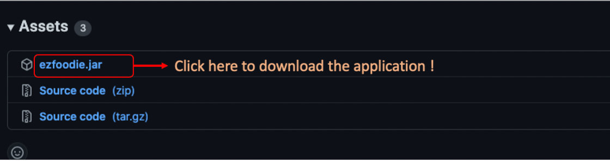
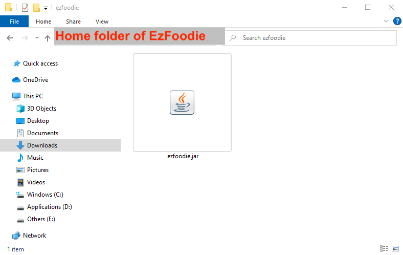
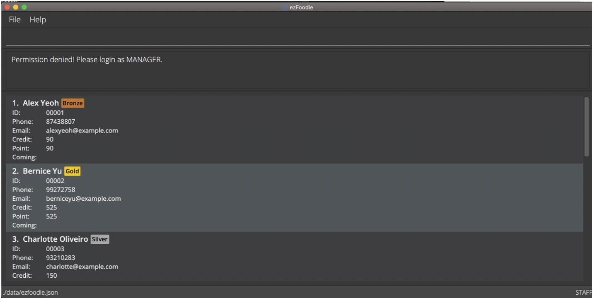
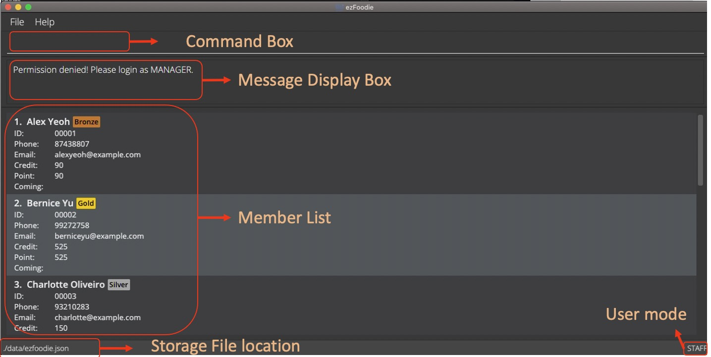
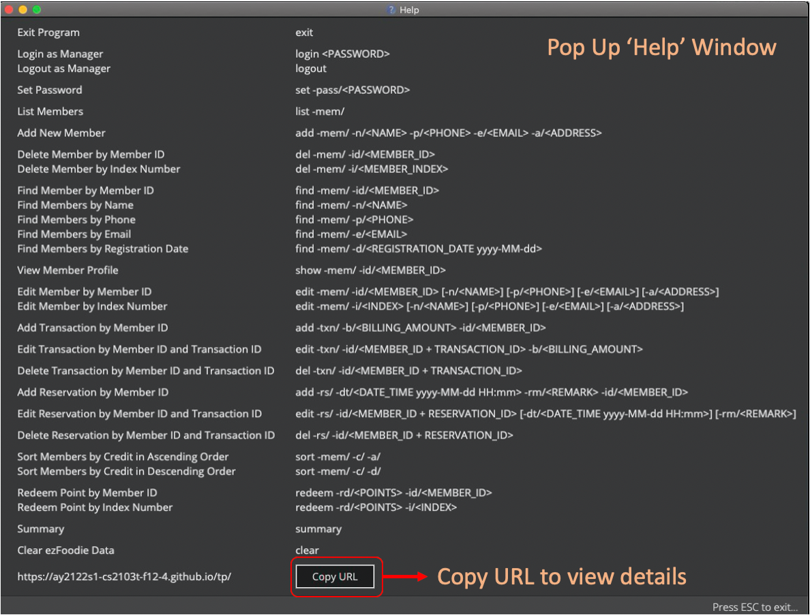
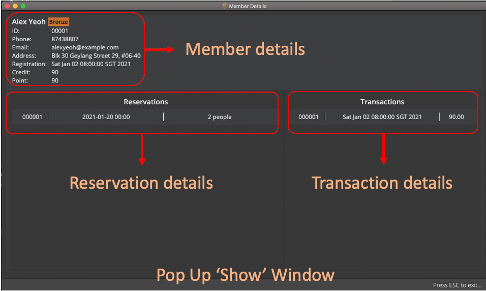
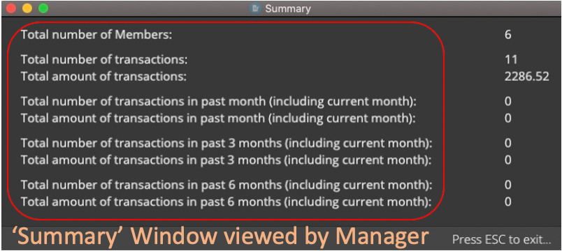
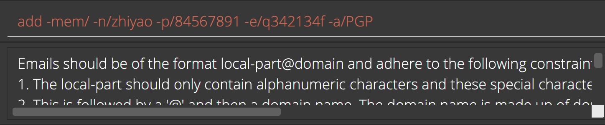

* Table of Contents
{:toc}

--------------------------------------------------------------------------------------------------------------------

## Introduction

Welcome to ezFoodie’s User Guide! 🤩

Have you faced issues when managing the members of your restaurant? ezFoodie is here!

ezFoodie is a desktop application that helps restaurants **keep track of their ever-growing list of members**. Restaurant managers and staff can easily view and update member statuses (e.g. personal information, tier, reservation, transaction, etc.) to manage and analyze members.

ezFoodie is simple and user-friendly. It is optimized for using via a **Command Line Interface (CLI)** while still enjoying the benefits of a Graphical User Interface (GUI). If you can type fast, ezFoodie can get your member management tasks done faster than traditional GUI applications.

ezFooide's current version is optimized for the **English language based user**, i.e, all CLI commands are **English-based**. As of now ezFoodie does not support other languages.

Continue reading to explore the wonders of ezFoodie and enhance the way you manage and analyze your restaurant's members 🤩

--------------------------------------------------------------------------------------------------------------------

## Purpose

**This User Guide aims to:**

1. Help new users get familiar with ezFoodie.

2. Provide a summary of all available commands in ezFoodie and their usages.

3. Show detailed explanations of all commands and possible issues users may face.

4. Frequently asked questions and answers.

--------------------------------------------------------------------------------------------------------------------

## Quick start

**<label id="step1">1. Ensure you have Java `11` or above installed in your computer.</label>**
   *  To check out the Java version you have installed in your computer, please click [here](https://www.java.com/en/download/help/version_manual.xml). 
   * If Java is not installed on your computer, please follow this [link](https://www.oracle.com/java/technologies/downloads/).
 

**2. Download the latest version of `ezfoodie.jar` from [here](https://github.com/AY2122S1-CS2103T-F12-4/tp/releases).**

   

 

**3. Copy the file to the folder you want to use as the _home folder_ for your ezFoodie.**

   

 

**4. Launch the application and view the details.**
* Double-click the file to start the application in windows system.
* If any issues are faced, go back to [step 1](#step1) and check Java version.
* In MacOS or Linux System, launch the termianl, go to the directory you saved `ezfoodie.jar` in, and key in the `java -jar ezfoodie.jar` command.* You can find details on how to run the JAR file [here](https://www.wikihow.com/Run-a-.Jar-Java-File).
* The GUI similar to the one shown below should appear in a few seconds. The application comes preloaded with sample data to test its features. 

   

   <h1 align="center">Congratulation! ezFoodie is now ready for your perusal. :+1:</h1>
    

**5. This section will walk you through the layout of ezFoodie.**
   <h1 align="center">Layout of Main Window</h1>
   

   
   <h1 align="center">Layout of Help Window</h1>
   

   <h1 align="center">Layout of Show Window</h1>
   

   

   <h1 align="center">Layout of Summary Window</h1>
   

   
    

**For more details, can refer to [Features](#features).**

**6. Main window GUI includes the following member fields and constraints:**
    
* **Index number in the list:**
   * *Only contains alphanumeric characters.*
   * *It ranges from `1` to `99999`.*

* **Name:**
   * *Only contains alphanumeric characters and spaces, and it should not be blank.*

* **Tier:**
   * *Bronze, Silver, Gold, Platinum.*
   * *This is automatically calculated from a member's credit.*
   * *Upgrade of Tier (e.g. Bronze -> Silver) is also automatically handled by ezFoodie.*
   
* **Member ID:**
   * *Member ID has only 5 digits' numerical value and starts from `00001` to `99999`.*
   * *Deleted Member's id will not be occupied when adding a new member.*
   * *Member id will increase automatically when a new member is added.*
   * *EzFoodie contains max `99999` members.*
   
* **Phone number:**
   * *Phone number should only contain 8 digits, and it should start with 3, 6, 8 or 9.*
   * *Members cannot share the same phone number or email. ezFoodie uses these fields to detect duplicate members.*

* **Email:**
   * *Email should be of the format in `local-part@domain`.*
   * *The `local-part` should only contain alphanumeric characters and
   these special characters: `+ _ . - `, the `local-part` may not start or end with 
   any special characters.*
   * *The `domain` name is made up of domain name separated by periods.*
   * *The `domain` name must:*
      * *End with a `domain` label at least 2 characters long.*
      * *Have each domain label start and end with alphanumeric characters.*
      * *Have each domain label consist of alphanumeric characters, 
      separated only by hyphens, if any.*
   *  *Members cannot share the same phone number or email. ezFoodie uses these fields to detect duplicate members.*
   
* **Credit:**
   * *Credit refers to the overall accumulated transaction billing amounts of a member, 
   starting from their registration date.*
   * *Credit depends on the billing amounts in [add transaction](#12), [delete transaction](#13)</a>, and [edit transaction](#14)*.
   * *Credit amount ranges from `0` to `99999999`.*
   
* **Point:**
   * *The point accumulation is similar to credit.*
   * *However, point can be redeemed as discounts to a member, and point will be deducted
   accordingly with redemption.*
   * *In <a href="#13">delete transaction</a>, the point will not be affected and will stay the same.*
   * *In <a href="#14">edit transaction</a>, the point will be increased when billing amount is greater than the billing amount added in last time. On the contrary the point will not be affected and keep the same when billing amount is lesser than the billing amount added in last time.*
   * *Point amount is range from `0` to `99999999`.*
   
* **Coming Seat Booking Information:**
   * Seats can be reserved using the [add reservation](#15) feature.
   * A reservation can be edited or deleted as well using the [edit reservation](#17) and [delete reservation](#16) features.
   * The maximum amount of reservations is `999999`.

**7. Type the command in the command box and press Enter to execute it. Some example commands you can try here:**

   * `help`: Opens the help window to view the commands and user guide.

   * `login 123456`: Changes user permissions from staff permissions to manager permissions.

   * `logout`: Logs out of manager and changes permissions to staff permissions.

   * `add -mem/ -n/John Doe -p/98765432 -e/johndoe@gmail.com -a/112 Amoy Street, 069907, Singapore`: Adds a contact named `John Doe` to the member list.

   * `list -mem/`: Lists all members.
   
   * `del -mem/ -i/3`: Deletes the member with index number 3 shown in the current list.
      

      
      :information_source: **Note:** Only managers can delete members. Login as a manager before entering the delete command.
      

   * `add -txn/ -b/200.00 -id/00001`: Adds transaction with a bill amount of $200.00 to member id 00001 shown in the current list.

   * `add -rs/ -dt/2021-12-25 00:00 -rm/2 people -id/00001`: Adds a reservation for 2 people for 2021-01-01 00:00 to member ID 00001 shown in the current list 

   * `show -mem/ -id/00001`: View all the details of a member, including all their transactions and reservations.

   * `redeem -rd/100 -id/00001`: Redeems 100 point from member id 00001 which is shown in the current list.
   
   * `set -pass/ 123456`: Sets the password to 123456 as in manager mode.

   * `summary`: Views a summary of all the data in the application in one page (**e.g.** No. of members, Past transactions).
      

      :information_source: **Note:** Only managers are allowed to view the summary of data. Login as a manager before entering the summary command.
      

      
   * `clear`: Clears the program.

   * `exit`: Exits the program.

**8. Please refer to the [Features](#features) below for details of each command.**

**9. Other components and constraints:**
    
   * **Transaction ID:**
      * *It only has 6 digits and starts from `000001` to `999999`.*
      * *Deleted Transaction ID's will not be occupied when adding a new transaction.*
      * *Transaction id will increase automatically when adding a new transaction.*

   * **Bill amount:**
      * *Bill amount is in the transaction feature.*
      * *Bill amounts should be non-negative numeric with 2 decimal places, and ranges from `0.00` to `9999.99`.*

   * **Reservation ID:**
      * *It only has 6 digits and starts from `000001` to `999999`.*
      * *Deleted reservation ids will not be occupied when adding a new member.*
      * *Reservation id will increase automatically when adding a new reservation.*
         
   * **Address:**
      * *Address can take any values. It should not be blank.*

   * **DateTime:**
      * *The format should be in yyyy-MM-dd HH:mm.*

* **Please follow the instructions shown in the application command box when you are facing constraint errors (attached below).**

 

--------------------------------------------------------------------------------------------------------------------

## Features

**Notes about the command format:** 

* Words in `UPPER_CASE` are the parameters to be supplied by the user. 
  e.g. in `find -mem/ -n/<NAME>`, `NAME` is a parameter which can be used as `find -mem/ -n/John Doe`.

* If a parameter is expected only once in the command, but you specified it multiple times, only the last occurrence of the parameter will be taken. 
  **e.g.** if you specify `-p/12341234 -p/56785678`, only `-p/56785678` will be taken.

* Extraneous parameters for commands that do not take in parameters (such as `help`, `exit` and `clear`) will be ignored. 
  **e.g.** if the command specifies `help 123`, it will be interpreted as `help`.

* Meanings of `prefix`:

    * `-id/`: member id, transaction id or reservation id

    * `-i/`: index number of a member in member list

    * `-mem/`: member

    * `-n/`: name

    * `-p/`: phone number

    * `-e/`: email id

    * `-a/`: address

    * `-txn/`: transaction

    * `-rs/`: reservation

    * `-dt/`: dateTime

    * `-d/`: date

    * `-c/`: credit

    * `-b/`: billing amount

    * `-rm/`: remark

    * `-rd/`: redeem

    * `-pass/`: password

    * `-tag/`: tag

   *ONLY USED IN SORT COMMAND*

    * `-a/`: ascending

    * `-d/`: descending
    
* **Requirements of input commands:**
   * When the user inputs a command, the prefixes is not to be inputted inside of the specified content.
   * E.g. The command "112`-p/` Amoy Street`-e/`, 069907, Singapore" is not allowed.

### 1. Viewing help : `help`

Opens a new window to show how to use the commands, and a link to the User Guide.

Format: `help`

Example: `help`

### 2. Exiting the program : `exit`

Exits the program.

Format: `exit`

Example: `exit`

### 3. Logging in as a manager : `login`

Logs in as a manager.

Format: `login <PASSWORD>`

*Default Manager Password is `123456`*

Example: `login 123456`

### 4. Setting and updating the password : `set`

Sets and updates the password to login as manger.

Format: `set -pass/<PASSWORD>`

Example: `set -pass/123456`

   :information_source: **Note:** The `set` command can only be used in manager mode.

### 5. Logging out as a manager : `logout`

Logs out as a manager.

Format: `logout`

Example: `logout`

   :information_source: **Note:** The `logout` command can only be used in manager mode.

### 6. Listing out a certain number of members : `list -mem/`

Lists out all members.

Format: `list -mem/`

Example: `list -mem/`

### 7. Adding a member : `add -mem/`

Adds a new member to the member list.

Format: `add -mem/ -n/<NAME> -p/<PHONE> -e/<EMAIL> -a/<ADDRESS>`

Example: `add -mem/ -n/John Doe -p/98765432 -e/johndoe@gmail.com -a/112 Amoy Street, 069907, Singapore`

   :information_source: **Note:** 

   * ezFoodie will not allow duplicate members and new members to have the same **phone number** or **email address** as a previously existing member.

### 8. Deleting a member : `del -mem/`

Deletes a member from the member list.

   :information_source: **Note:**
   * Only the manager is allowed to delete members. Login as manager before entering command.

#### 8.1.  Deleting a member by member id

Deletes a member using member id.

Format: `del -mem/ -id/<MEMBER_ID>`

Example: `del -mem/ -id/00001`

#### 8.2.  Deleting a member by index number

Deletes a member using member index number from the list.

Format: `del -mem/ -i/<MEMBER_INDEX>`

Example: `del -mem/ -i/1`

### 9. Finding members : `find -mem/`

Finds members by different fields which contain any of the given keywords.

   :information_source: **Note:**
   * No member will be listed when an invalid member field is entered.
   * The find is case-insensitive. e.g. `hans` will match `Hans`.
   * Only full words will be matched e.g. `Han` will not match `Hans`.
   * Find command is only allowed for **one single prefix** after **-mem/**.
   * In one single prefix find command, it can have multiple keywords. 
   * E.g. To find id:00001 and id:00002 members' detail: **"find -mem/ -id/00001 00002"**.
   * It is not allowed to enter command as **"find -mem/ -id/00001 -p/98765432"**.

#### 9.1. Finding member by member id

Format: `find -mem/ -id/<MEMBER_ID>`

Example: `find -mem/ -id/00001`

#### 9.2. Finding members by name

Format: `find -mem/ -n/<NAME>`

Example: `find -mem/ -n/John Doe`

#### 9.3. Finding members by phone

Format: `find -mem/ -p/<PHONE>`

Example: `find -mem/ -p/98765432`

#### 9.4. Finding members by email

Format: `find -mem/ -e/<EMAIL>`

Example: `find -mem/ -e/johndoe@gmail.com`

#### 9.5. Finding members by registration date

Format: `find -mem/ -d/<yyyy-MM-dd>`

Example: `find -mem/ -d/2021-01-02`

### 10. Showing member profile : `show -mem/`

Shows member from member list by member id.

Format: `show -mem/ -id/<MEMBER_ID>`

Example: `show -mem/ -id/00001`

   :information_source: **Note:** No member details will be shown when an invalid member id is entered.

### 11. Editing a member : `edit -mem/`

Edits different fields in a member's profile, where the member is specified by member id.

   :information_source: **Note:** Only deals with editing member details.
      If a member's transactions need to be edited, refer to [#14](#14) below. 
      Do not mix `-mem/` and `-txn/` in one `edit` command.

#### 11.1. Editing member name by member id

Format: `edit -mem/ -id/<MEMBER_ID> -n/<NAME>`

Example: `edit -mem/ -id/00001 -n/John Doe`

#### 11.2. Editing member phone by member id

Format: `edit -mem/ -id/<MEMBER_ID> -p/<PHONE>`

Example: `edit -mem/ -id/00001 -p/98765432`

#### 11.3. Editing member email by member id

Format: `edit -mem/ -id/<MEMBER_ID> -e/<EMAIL>`

Example: `edit -mem/ -id/00001 -e/johndoe@gmail.com`

#### 11.4. Editing member address by member id

Format: `edit -mem/ -id/<MEMBER_ID> -a/<ADDRESS>`

Example: `edit -mem/ -id/00001 -a/33 Benoi Crescent, 629979, Singapore`

#### 11.5. Editing member name by index number

Format: `edit -mem/ -i/<INDEX> -n/<NAME>`

Example: `edit -mem/ -i/1 -n/John Doe`

#### 11.6. Editing member phone by index number

Format: `edit -mem/ -i/<INDEX> -p/<PHONE>`

Example: `edit -mem/ -i/1 -p/98765432`

#### 11.7. Editing member email by index number

Format: `edit -mem/ -i/<INDEX> -e/<EMAIL>`

Example: `edit -mem/ -i/1 -e/johndoe@gmail.com`

#### 11.8. Editing member address by index number

Format: `edit -mem/ -i/<INDEX> -a/<ADDRESS>`

Example: `edit -mem/ -i/1 -a/33 Benoi Crescent, 629979, Singapore`

<label id="12"></label>

### 12. Adding transaction for members : `add -txn/`

Adds transaction amount corresponding to member id.

Format: `add -txn/ -b/<BILLING_AMOUNT> -id/<MEMBER_ID>`

Example: `add -txn/ -b/200.00 -id/00001`

   :information_source: **Note:** 
   * Transaction date and time is automatically assigned by local date and time when a transaction is added, there is no need to manually enter the transaction date or time.
   * The Credit and the Point will be accumulated based on billing amount. 
   * The maximum amount of transactions is `999999`.

<label id="13"></label> 

### 13.  Deleting transaction for members:`del -txn/`

Deletes a transaction.

Format: `del -txn/ -id/<MEMBER_ID + TRANSACTION_ID>`

Example: `del -txn/ -id/00001000001`

   :information_source: **Note:**
   * Only the manager is allowed to delete transactions. Login as manager before entering command.
   * Credit will be decreased based on bill amount in the deleted transaction.
   * Points will not be affected and will stay the same.

<label id="14"></label>

### 14. Editing transaction of a member: `edit -txn/`

Edits a member's transaction.

Format: `edit -txn/ -id/<MEMBER_ID + TRANSACTION_ID> -b/<BILLING_AMOUNT>`

Example: `edit -txn/ -id/00001000002 -b/10.00`

:information_source: **Note:** 
   * Transaction date and time cannot be modified once a transaction is added.
   * Credit will be changed based on the bill amount of added transaction.
   * Points will be increased when bill amount is greater than the bill amount 
    added in last time. On the contrary, points will not be affected and will stay the same when the bill amount is lesser
    than the bill amount added in last time. 

<label id="15"></label>

### 15. Adding a reservation: `add -rs/`

Adds a reservation to a member.

Format: `add -rs/ -dt/<yyyy-MM-dd HH:mm> -rm/<REMARK> -id/<MEMBER_ID>`

Example: `add -rs/ -dt/2021-01-02 00:00 -rm/2 people -id/00001`

:information_source: **Note:**
* A member cannot make multiple reservations for the same day.
* The maximum amount of reservations is `999999`.

<label id="16"></label>

### 16. Deleting a reservation: `del -rs/`

Deletes a reservation from a member's reservation list.

Format: `del -rs/ -id/<MEMBER_ID + RESERVATION_ID>`

Example: `del -rs/ -id/00001000001`

:information_source: **Note:**
   * Only the manager is allowed to delete reservations. Login as manager before entering command. 

<label id="17"></label>

### 17. Editing a reservation: `edit -rs/`

:information_source: **Note:** 
   * When editing the date time, the updated date time cannot share the same day as another reservation.
   * E.g. when a member makes a reservation for 2021-12-01 13:00 and another for 2021-12-02 13:00, the member is not allowed to edit the date of the 2nd december reservation to 1st december.

#### 17.1. Editing the date time in reservation: `edit -rs/ -dt/`
Edits the date time of a member's reservation details.

Format: `edit -rs/ -id/<MEMBER_ID + RESERVATION_ID> -dt/<DATE_TIME>`

Example: `edit -rs/ -id/00001000001 -dt/2021-12-01 13:00`

#### 17.2. Editing the remark in reservation: `edit -rs/ -rm/`
Edits the remark of a member's reservation details.

Format: `edit -rs/ -id/<MEMBER_ID + RESERVATION_ID> -rm/<REMARK>`

Example: `edit -rs/ -id/00001000001 -rm/3 people`

#### 17.3. Editing the date time and remark in reservation: `edit -rs/ -dt/ -rm/`
Edits the date time and remark member's reservation details.

Format: `edit -rs/ -id/<MEMBER_ID + RESERVATION_ID> [-dt/<DATE_TIME>][-rm/<REMARK>]`

Example: `edit -rs/ -id/00001000001 -dt/2021-12-01 13:00 -rm/3 people`

### 18. Sorting members by credit : `sort -mem/`

#### 18.1. Sorting member by credit in ascending order

Format: `sort -mem/ -c/ -a/`

Example: `sort -mem/ -c/ -a/`

#### 18.2. Sorting member by credit in descending order

Format: `sort -mem/ -c/ -d/`

Example: `sort -mem/ -c/ -d/`

### 19. Redeeming point `redeem -rd/`

#### 19.1. Redeeming point for a member by member id: `redeem -rd/ -id/`

Redeems the point of a member for a discount by member id.

Format: `redeem -rd/<POINT> -id/<MEMBER_ID>`

Example: `redeem -rd/100 -id/00001`

#### 19.2. Redeeming point for a member by index: `redeem -rd/ -i/`

Redeems the point of a member for a discount by index of member shown in the list.

Format: `redeem -rd/<point> -i/<INDEX>`

Example: `redeem -rd/100 -i/1`

:information_source: **Note:** 
   * Multiple redemptions can be made from one `-rd/` command 
   * To redeem 100 points and 20 points together from member 00001: `redeem -rd/100 -rd/10 -id/00001`.

### 20. Summary: `summary`

Views the summary of stored data in ezFoodie.

   :information_source: **Note:**:
   * Only the manager is allowed to view summary. Login as manager before entering command.

Format: `summary`

Example: `summary`

### 21. Clearing ezFoodie data: `clear`

Clears all data stored in ezFoodie. Use with Caution!

Format: `clear`

Example: `clear`

   :information_source: **Note:**
   * Only managers are allowed to clear. Login as manager before entering command.

### 22. Retrieving commands: `keyboard.UP` and `keyboard.DOWN`

Presses the keyboard "Up" button to retrieve previous command which has been entered, and "Down" button to retrieve next commands.

Format: press keyboard button ⬆️  and ⬇️

   :information_source: **Note:**
   * Retrieve commands can only store the history of 30 commands.

### 23. Exiting Summary, Help and Show popup window `keyboard.ESC`

Presses the keyboard `ESC` button to exit Summary, Help and Show popup window.

Format: press keyboard `ESC`

<label id="24"></label>

### 24. Saving the data

ezFoodie data are saved in a JSON file in hard disk `[JAR file location]/data/ezfoodie.json` automatically after any command that changes the data. There is no need to save manually.

### 25. Editing the data file

ezFoodie data are located at `[JAR file location]/data/ezfoodie.json`. Advanced users are welcome to update data directly by editing the data file.

:information_source: **Caution:**
If any changes to the JSON file renders it invalid, ezFoodie will discard all data and restart with an empty data file on the next run.

--------------------------------------------------------------------------------------------------------------------

## FAQ

**Q**: How do I transfer my data to another Computer? 
**A**: Install the application in the other computer and overwrite the empty data file it creates with the file that contains the data of your previous ezFoodie home folder.

**Q**: Why does my ezFoodie not have any populated sample member data? 
**A**: Delete `ezfoodie.json` and restart the application. Refer to [#24](#24) in *Features* above to find this JSON file.

**Q**: If I face any unexpected issues and I dont know how to solve it, how can I contact you? 
**A**: Please do not hesitate to drop us an email at `ezfoodie@gmail.com`.

--------------------------------------------------------------------------------------------------------------------

## Command summary

Action | Manager Only? (Y/N) | Format, Examples
--------------|---|------------------
**View Help** | N | *Format:*   `help`   *Example:*   `help`
**Exit Program** | N | *Format:*   `exit`   *Example:*   `exit`
**Login as Manager** | Y | *Format:*   `login <PASSWORD>`   *Example:*   `login 123456`
**Update a password** | Y | *Format:*   `set -pass/<PASSWORD>`   *Example:*   `set -pass/123456`
**Logout as Manager** | Y | *Format:*   `logout`   *Example:*   `logout`
**List Members** | N | *Format:*   `list -mem/`   *Example:*   `list -mem/`
**Add New Member** | N | *Format:*   `add -mem/ -n/<NAME> -p/<PHONE> -e/<EMAIL> -a/<ADDRESS>`   *Example:*   `add -mem/ -n/John Doe -p/98765432 -e/johndoe@gmail.com -a/112 Amoy Street, 069907, Singapore`
**Delete Member by Member Id** | Y | *Format:*   `del -mem/ -id/<MEMBER_ID>`   *Example:*   `del -mem/ -id/00001`  
**Delete Member by Index Number** | Y | *Format:*   `del -mem/ -i/<MEMBER_INDEX>`   *Example:*   `del -mem/ -i/1`
**Find Member by Member Id** | N | *Format:*   `find -mem/ -id/<MEMBER_ID>`   *Example:*   `find -mem/ -id/00001`
**Find Members by Name** | N | *Format:*   `find -mem/ -n/<NAME>`   *Example:*   `find -mem/ -n/John Doe`
**Find Members by Phone** | N | *Format:*   `find -mem/ -p/<PHONE>`   *Example:*   `find -mem/ -p/98765432`
**Find Members by Email** | N | *Format:*   `find -mem/ -e/<EMAIL>`   *Example:*   `find -mem/ -e/johndoe@gmail.com`
**Find Members by Registration Date** | N | *Format:*   `find -mem/ -d/<REGISTRATION_DATE yyyy-MM-dd>`   *Example:*   `find -mem/ -d/2021-01-02`
**Show Member Profile** | N | *Format:*   `show -mem/ -id/<MEMBER_ID>`   *Example:*   `show -mem/ -id/00001`
**Edit Member Name by Member Id** | N | *Format:*   `edit -mem/ -id/<MEMBER_ID> -n/<NAME>`   *Example*   `edit -mem/ -id/00001 -n/John Doe`
**Edit Member Phone by Member ID** | N | *Format*   `edit -mem/ -id/<MEMBER_ID> -p/<PHONE>`   *Example*   `edit -mem/ -id/00001 -p/98765432`
**Edit Member Email by Member Id** | N | *Format:*   `edit -mem/ -id/<MEMBER_ID> -e/<EMAIL>`   *Example:*   `edit -mem/ -id/00001 -e/johndoe@gmail.com`
**Edit Member Address by Member ID** | N | *Format:*   `edit -mem/ -id/<MEMBER_ID> -a/<ADDRESS>`   *Example:*   `edit -mem/ -id/00001 -a/33 Benoi Crescent, 629979, Singapore`
**Edit Member Name by Index Number** | N | *Format:*   `edit -mem/ -i/<INDEX> -n/<NAME>`   *Example:*   `edit -mem/ -i/1 -n/John Doe`
**Edit Member Phone by Index Number** | N | *Format:*   `edit -mem/ -i/<INDEX> -p/<PHONE>`   *Example:*   `edit -mem/ -i/1 -p/98765432`
**Edit Member Email by Index Number** | N | *Format:*   `edit -mem/ -i/<INDEX> -e/<EMAIL>`   *Example:*   `edit -mem/ -i/1 -e/johndoe@gmail.com`
**Edit Member Address by Index Number** | N | *Format:*   `edit -mem/ -i/<INDEX> -a/<ADDRESS>`   *Example:*   `edit -mem/ -i/1 -a/33 Benoi Crescent, 629979, Singapore`
**Add Transaction for Member** | N | *Format:*   `add -txn/ -id/<MEMBER_ID> -b/<BILLING_AMOUNT>`   *Example:*   `add -txn/ -b/200.00 -id/00001`
**Delete Transaction for Member** | Y | *Format:*   `del -txn/ -id/<MEMBER_ID + TRANSACTION_ID>`   *Example:*   `del -txn/ -id/00001000001`
**Edit Transaction** | N | *Format:*   `edit -txn/ -id/<MEMBER_ID + TRANSACTION_ID> -b/<BILLING_AMOUNT>`   *Example:*   `edit -txn/ -id/00001000002 -b/10.00`
**Add Reservation** | N | *Format:*   `add -rs/ -dt/<DATE_TIME yyyy-MM-dd HH:mm> -rm/<REMARK> -id/<MEMBER_ID>`   *Example:*   `add -rs/ -dt/2021-01-02 00:00 -rm/2 people -id/00001`
**Delete Reservation** | Y | *Format:*   `del -rs/ -id/<MEMBER_ID + RESERVATION_ID>`   *Example:*   `del -rs/ -id/00001000001`
**Edit Reservation** | N | *Format:*   `edit -rs/ -id/<MEMBER_ID + RESERVATION_ID> [-dt/<DATE_TIME>][-rm/<REMARK>]`   *Example:*   `edit -rs/ -id/00001000001 -dt/2021-12-01 13:00 -rm/3 people`
**Sort Members by Credit in Ascending Order** | N | *Format:*   `sort -mem/ -c/ -a/`   *Example:*   `sort -mem/ -c/ -a/`
**Sort Members by Credit in Descending Order** | N | *Format:*   `sort -mem/ -c/ -d/`   *Example:*   `sort -mem/ -c/ -d/`
**Redeem Point from Member by Member Id** | N | *Format:*   `redeem -rd/<POINT> -id/<MEMBER_ID>`   *Example:*   `redeem -rd/100 -id/00001`
**Redeem Point from Member by Member Index** | N | *Format:*   `redeem -rd/<point> -i/<INDEX>`   *Example:*   `redeem -rd/100 -i/1`
**Summary** | Y | *Format:*   `summary`   *Example:*   `summary`
**Clear ezFoodie Data** | Y | *Format:*   `clear`   *Example:*   `clear`
**Retrieve command** | N | *Example:*   Press ⬆️  and ⬇️
**Exiting Summary, Help and Show popup window** | Summary: Y   Help/View: N | *Example:*   Press keyboard `ESC` button
