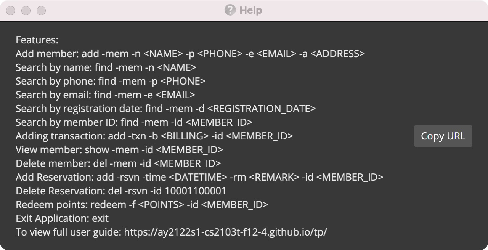

* Table of Contents
{:toc}

--------------------------------------------------------------------------------------------------------------------

# Introduction

Welcome to ezFoodie’s User Guide! 🤩

Have you faced issues when managing the members of your restaurant? ezFoodie is here!

ezFoodie is a desktop application that helps restaurants **keep track of their ever-growing list of members**. Restaurant managers and staffs can easily view and update member status (e.g. personal information, tier, reservation, transaction, etc.) to manage and analyze members.

ezFoodie is simple and user-friendly. It is optimized for using via a **Command Line Interface (CLI)** while still enjoying the benefits of a Graphical User Interface (GUI). If you can type fast, ezFoodie can get your member management tasks done faster than traditional GUI applications.

Continue reading to explore the wonders of ezFoodie and enhance the way you manage and analyze your restaurant's members 🤩

--------------------------------------------------------------------------------------------------------------------

# Purpose

This User Guide aims to:

1. Help new users get familiar with ezFoodie.

2. Provide a summary of all available commands in ezFoodie and their usages.

3. Show detailed explanations of all commands and possible issues users may face.

4. Frequently asked questions and answers.

--------------------------------------------------------------------------------------------------------------------

# Quick start

 **1. Ensure you have Java `11` or above installed in your computer from [here](https://www.oracle.com/java/technologies/downloads/).**

**2. Download the latest `ezFoodie.jar` from [here](https://github.com/AY2122S1-CS2103T-F12-4/tp/releases).**

**3. Copy the file to the folder you want to use as the _home folder_ for your ezFoodie.**

**4. Double-click the file to start the application. The GUI similar to the one shown below should appear in a few seconds. The application comes preloaded with sample data to test its features. **

   

   --------------------------------------------------------------------------------------------------------------------

   **Main window GUI includes the following member fields and constraints:**
    
* Index number in the list:
   * *Only contains alphanumeric characters.*
   * *It starts from `1`.*

* Name:
   * *Only contains alphanumeric characters and spaces, and it should not be blank.*

* Tier:
   * *Bronze, Silver, Gold, Platinum.*
   * *This is automatically calculated from a member's credit.*
   * *Upgrade (e.g. Bronze -> Silver) is also automatically handled by ezFoodie.*
   
* Member ID:
   * *It only has 5 digits and starts from `00001` to `99999`.*
   * *Deleted Member's id will not be occupied when adding a new member.*
   * *Member id will increase automatically when add a new member.*
   
* Phone number:
   * *Phone number should only contain 8 digits, and it should start with 3, 6, 8 or 9.*

* Email:
   * *Email should be the format in `local-part@domain`.*
   * *The `local-part` should only contain alphanumeric characters and
   these special characters: `+ _ . - `, and the `local-part` may not start or end with 
   any special characters.*
   * *The `domain` name is made up of domain name separated by periods.*
   * *The `domain` name must:*
      * *Ends with a `domain` label at least 2 characters long.*
      * *Have each domain label start and end with alphanumeric characters.*
      * *have each domain label consist of alphanumeric characters, 
      separated only by hyphens, if any.*
   
* Credit:
   * *Credit refers to the overall accumulated transaction billing of a member, 
   starting from his registration date.*
   * *Credit depends on amounts of billing in <a href="#12">add transaction</a>, <a href="#13">delete transaction</a>, and <a href="#14">edit transaction</a>*.
   
* Point:
   * *The point accumulation is similar to credit.*
   * *However, point can be redeemed as amounts of cash deduction to a member, and point will be deducted
   accordingly with redemption.*
   * *In <a href="#13">delete transaction</a>, the point will not be affected and keep the same.*
   * *In <a href="#14">edit transaction</a>, the point will be increased when billing amount is greater than the billing amount 
   added in last time. on the contrary the point will not be affected and keep the same when billing amount is lesser
   than the billing amount added in last time.*
   
* Seat Booking Information

--------------------------------------------------------------------------------------------------------------------

**5. Type the command in the command box and press Enter to execute it. e.g. typing **`help`** and pressing Enter will open the help window. Some example commands you can try:**

   * `login 123456:` Changes user permissions from staff permissions to manager permissions.

   * `logout:` Logouts of manager and change permissions to staff permissions.

   * `list -mem/:` Lists all members.

   * `add -mem/ -n/John Doe -p/98765432 -e/johndoe@gmail.com -a/112 Amoy Street, 069907, Singapore:` Adds a contact named `John Doe` to the member list.

   * `del -mem/ -i/3:` Deletes the member with index number 3 shown in the current list.

      **Note:** Only managers can delete members. Login as a manager before entering the delete command.

   * `add -txn/ -id/00001 -b/200.00:` Adds transaction with a billing $100.00 to member ID 00001 shown in the current list.

   * `add -rs/ -dt/2021-01-02 00:00 -rm/2 people -id/00001:` Adds a reservation for 2 people for 2021-01-01 00:00 to member ID 00001 shown in the current list 

   * `redeem -rd/100 -id/00001:` Redeems 100 point from member id 00001 which is shown in the current list.
   
   * `set -pass/ 123456:` Sets and updates the password to 123456 as in manager mode.

   * `summary:` Views a summary of all the data in the application in one page (**e.g.** No. of members, Past transactions).
     
      **Note:** Only managers are allowed to view the summary of data. Login as a manager before entering the summary command.
      
   * `clear:` Clears the program.

   * `exit:` Exits the program.

**6. Please refer to the [Features](#features) below for details of each command.**

--------------------------------------------------------------------------------------------------------------------

**7. Other components and constraints:**
    
   * Transaction ID:
      * *It only has 6 digits and starts from `000001` to `999999`.*
      * *Deleted Transaction's id will not be occupied when adding a new transaction.*
      * *Transaction id will increase automatically when add a new transaction.*
      
   * Reservation ID:
      * *It only has 6 digits and starts from `000001` to `999999`.*
      * *Deleted reservation's id will not be occupied when adding a new member.*
      * *Reservation id will increase automatically when add a new reservation.*
         
   * Address:
      * *Addresses can take any values, and it should not be blank.*

   * DateTime:
      * *The format should be in yyyy-MM-dd HH:mm*

* **Please follow the instruction shown is the application command box when your are occuring constraint errors (attached below).**

--------------------------------------------------------------------------------------------------------------------

# Features

**:information_source: Notes about the command format:** 

* Words in `UPPER_CASE` are the parameters to be supplied by the user. 
  e.g. in `find -mem/ -n/<NAME>`, `NAME` is a parameter which can be used as `find -mem/ -n/John Doe`.

* If a parameter is expected only once in the command but you specified it multiple times, only the last occurrence of the parameter will be taken. 
  **e.g.** if you specify `-p/12341234 -p/56785678`, only `-p/56785678` will be taken.

* Extraneous parameters for commands that do not take in parameters (such as `help`, `exit` and `clear`) will be ignored. 
  **e.g.** if the command specifies `help 123`, it will be interpreted as `help`.

* Meanings of shortcuts:

    * `-id/`: member ID or transaction ID

    * `-i/`: index number of a member in member list

    * `-mem/`: member

    * `-n/`: name

    * `-p/`: phone no.

    * `-e/`: email ID

    * `-a/`: address

    * `-txn/`: transaction

    * `-rs/`: reservation

    * `-dt/`: dateTime

    * `-d/`: date

    * `-c/`: credit

    * `-b/`: billing amount

    * `-rm/`: remark

    * `-rd/`: redeem

    * `-pass/`: password

    * `-tag/`: tag

   **ONLY USED IN SORT COMMAND**

    * `-a/`: ascending

    * `-d/`: descending

### 1. Viewing help : `help`

Opens a new window to show how to use the commands, and a link to the User Guide.

Format: `help`

Example: `help`

### 2. Exiting the program : `exit`

Exits the program.

Format: `exit`

### 3. Logging in as a manager : `login`

Logins as a manager.

Format: `login <PASSWORD>`

*Default Manager Password is `123456`*

Example: `login 123456`

### 4. Setting and updating the password : `set`

Sets and updates the password in the manger mode. 

Format: `set -pass/<PASSWORD>`

Example: `set -pass/123456`

**Note:** The `set` command is only applied in manager mode.

### 5. Logging out as a manager : `logout`

Logs out as a manager.

Format: `logout`

Example: `logout`

**Note:** The `logout` command is only applied in manager mode.

### 6. Listing out a certain number of members : `list -mem/`

Lists out a certain number of members.

Format: `list -mem/`

Example: `list -mem/`

### 7. Adding a member : `add -mem/`

Adds a new member to the member list.

Format: `add -mem/ -n/<NAME> -p/<PHONE> -e/<EMAIL> -a/<ADDRESS>`

Example: `add -mem/ -n/John Doe -p/98765432 -e/johndoe@gmail.com -a/112 Amoy Street, 069907, Singapore`

**information_source: Duplicate members: ** 

* ezFoodie will not allow adding members with the same **phone number** or **email address** as an existing member.

### 8. Deleting a member : `del -mem/`

Deletes a member from the member list

**Note:** 
   * The `del` member command is only applied in manager mode.
   * Only the manager is allowed to delete members. Login as manager before entering command.

#### 8.1.  Deleting a member by ID

Deletes a member using member id

Format: `del -mem/ -id/<MEMBER_ID>`

Example: `del -mem/ -id/00001`

#### 8.2.  Deleting a member by index number

Deletes a member using member index number from the list

Format: `del -mem/ -i/<MEMBER_INDEX>`

Example: `del -mem/ -i/1`

### 9. Finding members : `find -mem/`

Finds members by different fields which contain any of the given keywords.

* The find is case-insensitive. e.g. `hans` will match `Hans`.
* Only full words will be matched e.g. `Han` will not match `Hans`.

**Note:** No member will be listed when an invalid member field is entered.

#### 9.1. Finding member by member ID

Format: `find -mem/ -id/<MEMBER_ID>`

Example: `find -mem/ -id/00001`

#### 9.2. Finding members by name

Format: `find -mem/ -n/<NAME>`

Example: `find -mem/ -n/John Doe`

#### 9.3. Finding members by phone

Format: `find -mem/ -p/<PHONE>`

Example: `find -mem/ -p/98765432`

#### 9.4. Finding members by email

Format: `find -mem/ -e/<EMAIL>`

Example: `find -mem/ -e/johndoe@gmail.com`

#### 9.5. Finding members by registration date

Format: `find -mem/ -d/<yyyy-MM-dd>`

Example: `find -mem/ -d/2021-01-02`

### 10. Viewing member profile : `show -mem/`

Views member from member list by member ID.

Format: `show -mem/ -id/ <MEMBER_ID>`

Example: `show -mem/ -id/00001`

**Note:** No member details will be shown when an invalid member ID is entered.

### 11. Editing a member : `edit -mem/`

Edits different fields in a member's profile, where the member is specified by member ID.

**Note:** Only deals with editing member details.
   If a member's transactions need to be edited, refer to [#13](#13) below. 
   Do not mix `-mem/` and `-txn/` in one `edit` command.

#### 11.1. Editing member name by member ID

Format: `edit -mem/ -id/<MEMBER_ID> -n/<NAME>`

Example: `edit -mem/ -id/00001 -n/John Doe`

#### 11.2. Editing member phone by member ID

Format: `edit -mem/ -id/<MEMBER_ID> -p/<PHONE>`

Example: `edit -mem/ -id/00001 -p/98765432`

#### 11.3. Editing member email by member ID

Format: `edit -mem/ -id/<MEMBER_ID> -e/<EMAIL>`

Example: `edit -mem/ -id/00001 -e/johndoe@gmail.com`

#### 11.4. Editing member address by member ID

Format: `edit -mem/ -id/<MEMBER_ID> -a/<ADDRESS>`

Example: `edit -mem/ -id/00001 -a/33 Benoi Crescent, 629979, Singapore`

#### 11.5. Editing member name by index number

Format: `edit -mem/ -i/<INDEX> -n/<NAME>`

Example: `edit -mem/ -i/1 -n/John Doe`

#### 11.6. Editing member phone by index number

Format: `edit -mem/ -i/<INDEX> -p/<PHONE>`

Example: `edit -mem/ -i/1 -p/98765432`

#### 11.7. Editing member email by index number

Format: `edit -mem/ -i/<INDEX> -e/<EMAIL>`

Example: `edit -mem/ -i/1 -e/johndoe@gmail.com`

#### 11.8. Editing member address by index number

Format: `edit -mem/ -i/<INDEX> -a/<ADDRESS>`

Example: `edit -mem/ -i/1 -a/33 Benoi Crescent, 629979, Singapore`

### 12. <label id="12">Adding transaction for members :</label> `add -txn/`

Adds transaction amount corresponding to member ID.

Format: `add -txn/ -id/<MEMBER_ID> -b/<BILLING_AMOUNT>`

Example: `add -txn/ -id/00001 -b/200.00`

**Note:** 
   * Transaction date and time is automatically assigned by local date and time when a transaction is added, 
   there is no need to manually enter the transaction date or time.
   * The Credit and the Point will be accumulated based on billing amount. 

### 13.  <label id="13">Deleting transaction for members:</label> `del -txn/`

Deletes a transaction.

Format: `del -txn/ -id/<MEMBER_ID + TRANSACTION_ID>`

Example: `del -txn/ -id/00001000001`

**Note:** 
   * The `del` transaction command is only applied in manager mode.
   * Only the manager are allowed to delete transactions. Login as manager before entering command.
   * The Credit will be decreased based on billing amount in related transaction.
   * The Point will not be affected and keep the same.

### 14. <label id="14">Editing transaction of a member:</label> `edit -txn/`

Edits a member's transaction.

Format: `edit -txn/ -id/<MEMBER_ID + TRANSACTION_ID> -b/ <BILLING_AMOUNT>`

Example: `edit -txn/ -id/00001000002 -b/ 10.00`

**Note:** 
   * Transaction date and time cannot be modified once a transaction is added.
   * The Credit will be changed based on billing amount in related transaction.
   * The Point will be increased when billing amount is greater than the billing amount 
    added in last time. on the contrary the point will not be affected and keep the same when billing amount is lesser
    than the billing amount added in last time. 

### 15. Adding a reservation: `add -rs/`

Adds a reservation to a member.

Format: `add -rs/ -dt/<yyyy-MM-dd HH:mm> -rm/ <REMARK> -id/ <MEMBER_ID>`

Example: `add -rs/ -dt/2021-01-02 00:00 -rm/2 people -id/00001`

**Note:** Same member which based on member id cannot make multiple reservations on the same day.

### 16. Deleting a reservation: `del -rs/`

Deletes a reservation from a member's reservation list.

Format: `del -rs/ -id/<MEMBER_ID + RESERVATION_ID>`

Example: `del -rs/ -id/00001000001`

**Note:** 
   * The `del` reservation command is only applied in manager mode.
   * Only the manager is allowed to delete reservations. Login as manager before entering command. 

### 17. Editing a reservation: `edit -rs/`
**Note:** 
   * The editing reservation date time cannot be shifted in same day based on same member id.
   * E.g. when one member make a reservation in day 2021-12-01 13:00 and 2021-12-02 13:00, the member is not allowed to shift 2 day in same day. 

#### 17.1. Editing a date time in reservation: `edit -rs/ -dt/`
Edits a member's reservation details in date time.

Format: `edit -rs/ -id/<MEMBER_ID + RESERVATION_ID> -dt/<DATE_TIME>`

Example: `edit -rs/ -id/00001000001 -dt/2021-12-01 13:00`

#### 17.2. Editing a date time in reservation: `edit -rs/ -rm`
Edits a member's reservation details in remark.

Format: `edit -rs/ -id/<MEMBER_ID + RESERVATION_ID> -rm/<REMARK>`

Example: `edit -rs/ -id/00001000001 -rm/3 people`

#### 17.3. Editing a date time and remark in reservation: `edit -rs/ -dt -rm`
Edits a member's reservation details in date time.

Format: `edit -rs/ -id/<MEMBER_ID + RESERVATION_ID> [-dt/<DATE_TIME>][-rm/<REMARK>]`

Example: `edit -rs/ -id/00001000001 -dt/2021-12-01 13:00 -rm/3 people`

### 18. Sorting members by credit : `sort -mem/`

#### 18.1. Sorting member by credit in ascending order

Format: `sort -mem/ -c/ -a/`

Example: `sort -mem/ -c/ -a/`

#### 18.2. Sorting member by credit in descending order

Format: `sort -mem/ -c/ -d/`

Example: `sort -mem/ -c/ -d/`

### 19. Redeeming point `redeem -rd/`

#### 19.1. Redeeming point for a member by member id: `redeem -f/ -id/`
Redeems point is award as amounts of cash deduction to a member according to member id.

Format: `redeem -rd/<POINT> -id/<MEMBER_ID>`

Example: `redeem -rd/100 -id/00001`

#### 19.2. Redeeming point for a member by index: `redeem -f/ -i/`

Redeems point is award as amounts of cash deduction to a member whose index shown in the member list.

Format: `redeem -rd/<point> -i/<INDEX>`

Example: `redeem -rd/100 -i/1`

### 20. Summary: `summary`

Views the summary of stored data in ezFoodie.

**Note:**: 
* The `summary` command is only applied in manager mode.
* Only the manager is allowed to view summary. Login as manager before entering command.

Format: `summary`

Example: `summary`

### 21. Clearing ezFoodie data : `clear`

Clears all data stored in ezFoodie. Use with Caution!

Format: `clear`

Format: `clear`

**Note:**
* The `clear` command is only applied in manager mode.
* Only managers are allowed to clear. Login as manager before entering command.

### 22. <label id="22">Saving the data</label>

ezFoodie data are saved in a JSON file in hard disk automatically after any command that changes the data. There is no need to save manually.

### 23. Editing the data file

ezFoodie data are located at `[JAR file location]/data/ezFoodie.json`. Advanced users are welcome to update data directly by editing the data file.

:exclamation: **Caution:**
If any changes to the JSON file make it invalid, ezFoodie will discard all data and restart with an empty data file at the next run.

--------------------------------------------------------------------------------------------------------------------

## FAQ

**Q**: How do I transfer my data to another Computer? 
**A**: Install the application in the other computer and overwrite the empty data file it creates with the file that contains the data of your previous ezFoodie home folder.

**Q**: Why my ezFoodie does not have any populated sample member data? 
**A**: Delete `ezfoodie.json` and restart the application. Refer to <a href="#22">#22</a> in *Features* above to find this JSON file.

--------------------------------------------------------------------------------------------------------------------

## Command summary

Action | Manager Only? (Y/N) | Format, Examples
--------------|---|------------------
**View Help** | N | *Format:*   `help`   *Example:*   `help`
**Exit Program** | N | *Format:*   `exit`   *Example:*   `exit`
**Login as Manager** | Y | *Format:*   `login <PASSWORD>`   *Example:*   `login 123456`
**Update a password** | Y | *Format:*   `set -pass/<PASSWORD>`   *Example:*   `set -pass/123456`
**Logout as Manager** | Y | *Format:*   `logout`   *Example:*   `logout`
**List Members** | N | *Format:*   `list -mem/`   *Example:*   `list -mem/`
**Add New Member** | N | *Format:*   `add -mem/ -n/<NAME> -p/<PHONE> -e/<EMAIL> -a/<ADDRESS>`   *Example:*   `add -mem/ -n/John Doe -p/98765432 -e/johndoe@gmail.com -a/112 Amoy Street, 069907, Singapore`
**Delete Member by Member ID** | Y | *Format:*   `del -mem/ -id/<MEMBER_ID>`   *Example:*   `del -mem/ -id/ 00001`  
**Delete Member by Index Number** | Y | *Format:*   `del -mem/ -i/<MEMBER_INDEX>`   *Example:*   `del -mem/ -i/1`
**Find Member by Member ID** | N | *Format:*   `find -mem/ -id/<MEMBER_ID>`   *Example:*   `find -mem/ -id/00001`
**Find Members by Name** | N | *Format:*   `find -mem/ -n/<NAME>`   *Example:*   `find -mem/ -n/John Doe`
**Find Members by Phone** | N | *Format:*   `find -mem/ -p/<PHONE>`   *Example:*   `find -mem/ -p/98765432`
**Find Members by Email** | N | *Format:*   `find -mem/ -e/<EMAIL>`   *Example:*   `find -mem/ -e/johndoe@gmail.com`
**Find Members by Registration Date** | N | *Format:*   `find -mem/ -d/<REGISTRATION_DATE yyyy-MM-dd>`   *Example:*   `find -mem/ -d/2021-01-02`
**View Member Profile** | N | *Format:*   `show -mem/ -id/<MEMBER_ID>`   *Example:*   `show -mem/ -id/00001`
**Edit Member Name by Member ID** | N | *Format:*   `edit -mem/ -id/<MEMBER_ID> -n/<NAME>`   *Example*   `edit -mem/ -id/00001 -n/John Doe`
**Edit Member Phone by Member ID** | N | *Format*   `edit -mem/ -id/<MEMBER_ID> -p/<PHONE>`   *Example*   `edit -mem/ -id/00001 -p/98765432`
**Edit Member Email by Member ID** | N | *Format:*   `edit -mem/ -id/<MEMBER_ID> -e/<EMAIL>`   *Example:*   `edit -mem/ -id/00001 -e/johndoe@gmail.com`
**Edit Member Address by Member ID** | N | *Format:*   `edit -mem/ -id/<MEMBER_ID> -a/<ADDRESS>`   *Example:*   `edit -mem/ -id/00001 -a/33 Benoi Crescent, 629979, Singapore`
**Edit Member Name by Index Number** | N | *Format:*   `edit -mem/ -i/<INDEX> -n/ <NAME>`   *Example:*   `edit -mem/ -i/1 -n/John Doe`
**Edit Member Phone by Index Number** | N | *Format:*   `edit -mem/ -i/<INDEX> -p/<PHONE>`   *Example:*   `edit -mem/ -i/1 -p/98765432`
**Edit Member Email by Index Number** | N | *Format:*   `edit -mem/ -i/<INDEX> -e/<EMAIL>`   *Example:*   `edit -mem/ -i/1 -e/johndoe@gmail.com`
**Edit Member Address by Index Number** | N | *Format:*   `edit -mem/ -i/<INDEX> -a/<ADDRESS>`   *Example:*   `edit -mem/ -i/1 -a/33 Benoi Crescent, 629979, Singapore`
**Add Transaction for Member** | N | *Format:*   `add -txn/ -id/<MEMBER_ID> -b/<BILLING_AMOUNT>`   *Example:*   `add -txn/ -id/00001 -b/200.00`
**Delete Transaction for Member** | Y | *Format:*   `del -txn/ -id/<MEMBER_ID + TRANSACTION_ID>`   *Example:*   `del -txn/ -id/00001000001`
**Edit Transaction** | N | *Format:*   `edit -txn/ -id/ <MEMBER_ID + TRANSACTION_ID> -b/<BILLING_AMOUNT>`   *Example:*   `edit -txn/ -id/ 00001000002 -b/ 10.00`
**Add Reservation** | N | *Format:*   `add -rs/ -dt/ <DATE_TIME yyyy-MM-dd HH:mm> -rm/ <REMARK> -id/ <MEMBER_ID>`   *Example:*   `add -rs/ -dt/ 2021-01-02 00:00 -rm/ 2 people -id/ 00001`
**Delete Reservation** | Y | *Format:*   `del -rs/ -id/ <MEMBER_ID + RESERVATION_ID>`   *Example:*   `del -rs/ -id/ 00001000001`
**Edit Reservation** | N | *Format:*   `edit -rs/ -id/<MEMBER_ID + RESERVATION_ID> [-dt/<DATE_TIME>][-rm/<REMARK>]`   *Example:*   `edit -rs/ -id/00001000001 -dt/2021-12-01 13:00 -rm/3 people`
**Sort Members by Credit in Ascending Order** | N | *Format:*   `sort -mem/ -c/ -a/`   *Example:*   `sort -mem/ -c/ -a/`
**Sort Members by Credit in Descending Order** | N | *Format:*   `sort -mem/ -c/ -d/`   *Example:*   `sort -mem/ -c/ -d/`
**Redeem Point from Member by Member Id** | N | *Format:*   `redeem -rd/<POINT> -id/<MEMBER_ID>`   *Example:*   `redeem -rd/100 -id/00001`
**Redeem Point from Member by Member Index** | N | *Format:*   `redeem -rd/<point> -i/<INDEX>`   *Example:*   `redeem -rd/100 -i/1`
**Summary** | Y | *Format:*   `summary`   *Example:*   `summary`
**Clear ezFoodie Data** | Y | `clear`   *Example:*   `clear`

